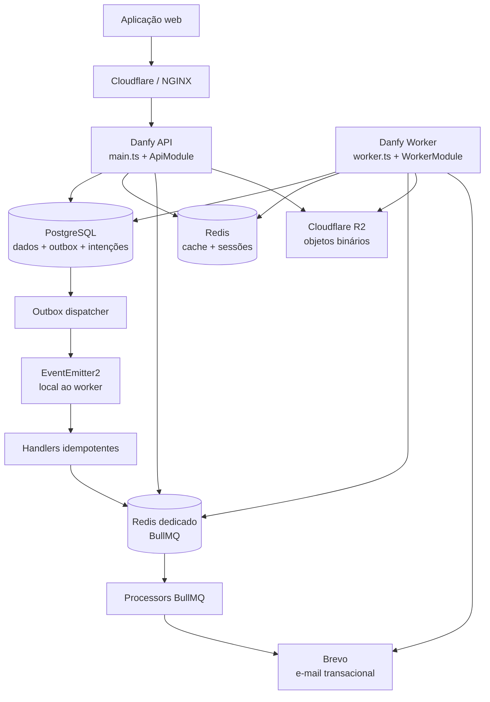
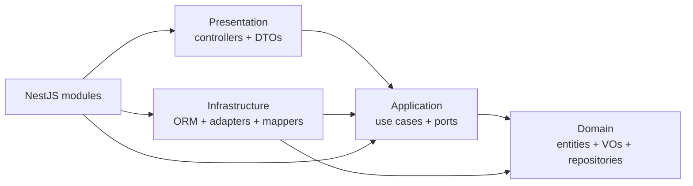
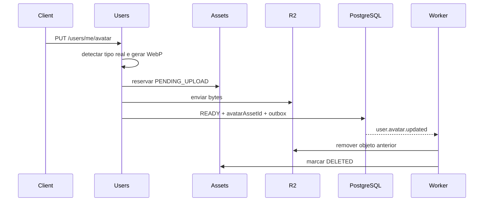

# Arquitetura e organização do código

Este documento apresenta a arquitetura atual do backend da Danfy, explica como as partes dependem umas das outras e define o padrão para evoluir o código sem romper os limites do projeto.

Ele funciona como mapa de entrada. Regras específicas continuam pertencendo às documentações de domínio, às integrações HTTP e às specs de cada feature.

## Princípios arquiteturais

O backend é um monólito modular NestJS orientado por Domain-Driven Design e Clean Architecture.

Os princípios centrais são:

- um único repositório, package, build e schema PostgreSQL;
- módulos organizados por domínio e capacidade;
- regras de negócio independentes de NestJS, TypeORM e serviços externos;
- dependências apontando das bordas para contratos internos;
- PostgreSQL como fonte da verdade para dados de negócio, outbox e intenções de e-mail;
- API HTTP e worker assíncrono executados como processos separados;
- processamento assíncrono com semântica at-least-once e consumidores idempotentes;
- infraestrutura externa acessada por portas e adapters;
- isolamento multi-tenant sempre baseado no usuário autenticado;
- evolução de features guiada por specs vivas.

Separar API e worker não transforma o sistema em microserviços. Os dois processos compartilham domínio, código, banco, contratos e versão da imagem.

## Visão geral



## Processos da aplicação

### API

O processo API começa em `api/src/main.ts` e usa `ApiModule` como composition root.

Responsabilidades:

- abrir o servidor HTTP;
- configurar cookies, CORS, Helmet, validação e Swagger;
- executar guards e o filtro global de exceções;
- autenticar usuários e executar casos de uso síncronos;
- persistir dados de negócio;
- gravar eventos na outbox dentro da transação de negócio;
- produzir jobs BullMQ quando houver uma intenção persistida;
- expor liveness e readiness.

A API não registra:

- polling ou processamento da outbox;
- handlers `@OnEvent`;
- processors BullMQ;
- reconciliadores periódicos;
- provider responsável por enviar e-mails.

Escalar a API aumenta a capacidade HTTP, mas não cria novos consumidores assíncronos.

### Worker

O processo worker começa em `api/src/worker.ts` e usa `WorkerModule` como composition root.

Ele é iniciado com `NestFactory.createApplicationContext()` e não abre servidor HTTP de negócio.

Responsabilidades:

- reivindicar e processar mensagens da outbox;
- reidratar eventos persistidos;
- publicar eventos no EventEmitter2 local;
- executar handlers assíncronos;
- consumir jobs BullMQ;
- reconciliar intenções de e-mail que ainda não chegaram à fila;
- remover assets substituídos ou desvinculados;
- enviar e-mails por meio do provider configurado;
- manter heartbeat e encerrar o processamento de forma graciosa.

Escalar o worker aumenta a capacidade assíncrona sem expor novas rotas públicas.

### Dependências por processo

| Capacidade               | API                            | Worker                                |
| ------------------------ | ------------------------------ | ------------------------------------- |
| PostgreSQL               | leitura e escrita              | leitura, escrita e claim da outbox    |
| Redis de cache e sessões | cache, sessões e rate limiting | cache exigido por repositories ativos |
| Redis BullMQ             | producer                       | producer e consumer                   |
| Object Storage           | upload e leitura de assets     | limpeza de assets                     |
| JWT, OAuth e CSRF        | sim                            | não                                   |
| Provider de e-mail       | não                            | sim                                   |
| Controllers e Swagger    | sim                            | não                                   |
| EventEmitter2 e handlers | não                            | sim                                   |

API e worker usam a mesma imagem Docker, mas recebem commands, roles e conjuntos de secrets distintos.

## Composition roots

Composition root é o ponto que decide quais capacidades existem em determinado processo.

```text
api/src/
├── main.ts
├── worker.ts
├── worker-health.ts
└── app/
    ├── api/
    │   ├── api.controller.ts
    │   └── api.module.ts
    ├── shared/
    │   └── assert-process-role.ts
    └── worker/
        ├── composition/
        │   ├── outbox-rehydrators.module.ts
        │   └── worker-event-consumers.module.ts
        ├── health/
        ├── operations/
        └── worker.module.ts
```

`PROCESS_ROLE` valida que o entrypoint e o papel configurado correspondem. Ele não funciona como feature flag dentro dos providers: o próprio grafo de módulos determina as capacidades ativas.

### Grafo da API

```text
ApiModule
├── ConfigModule
├── PostgresModule
├── RedisModule
├── JobsModule
├── OutboxWriterModule
├── NotificationsProducerModule
├── módulos HTTP de negócio
├── HealthModule
└── guards e filter globais
```

### Grafo do worker

```text
WorkerModule
├── ConfigModule
├── PostgresModule
├── RedisModule
├── JobsModule
├── AppEventsModule
├── OutboxDispatcherModule
├── OutboxRehydratorsModule
├── WorkerEventConsumersModule
├── NotificationsWorkerModule
└── WorkerOperationsModule
```

Testes de composição protegem esses grafos contra imports indiretos que poderiam reintroduzir processors na API ou controllers no worker.

## Organização do código

```text
api/src/
├── app/             composition roots e lifecycle dos processos
├── common/          contratos e mecanismos transversais da API
├── config/          leitura e validação de configuração
├── database/        conexões compartilhadas e migrations
├── modules/         bounded contexts e features de negócio
├── shared/          capacidades técnicas reutilizáveis
├── types/           extensões e declarações TypeScript
├── main.ts          entrypoint HTTP
├── worker.ts        entrypoint assíncrono
└── worker-health.ts health check one-shot do worker
```

### `app/`

Contém wiring e lifecycle. Não contém regra de negócio.

Use essa área para:

- composition roots;
- agregação explícita de handlers e hydrators;
- bootstrap e shutdown;
- health e heartbeat específicos do processo;
- validação do role executado.

### `common/`

Contém elementos transversais usados principalmente pela aplicação HTTP:

- decorators;
- DTOs de plataforma;
- filtros;
- constantes e enums compartilhados;
- interfaces transversais;
- validação;
- utilitários sem ownership de um domínio específico.

Uma regra pertencente a Accounts, Auth ou outro bounded context não deve ser movida para `common/` apenas para facilitar imports.

### `config/`

Centraliza configuração tipada e validação de ambiente.

Novas variáveis devem:

- ser lidas em uma configuração com responsabilidade clara;
- ser validadas no bootstrap;
- respeitar o conjunto de secrets necessário para cada processo;
- ser adicionadas ao `.env.exemple`;
- nunca possuir fallback que misture Redis de cache com Redis BullMQ.

### `database/`

Contém:

- `PostgresModule`;
- `RedisModule`;
- data source do TypeORM;
- migrations incrementais.

`synchronize` permanece desabilitado. Toda mudança de schema exige migration e atualização de `docs/database/schema.md`.

### `modules/`

Cada diretório representa um domínio ou capacidade de produto:

```text
api/src/modules/<domain>/
├── domain/
├── application/
├── infrastructure/
├── presentation/
└── *.module.ts
```

Os módulos atuais são:

- `accounts`;
- `assets`;
- `auth`;
- `categories`;
- `health`;
- `notifications`;
- `transactions`;
- `users`.

### `shared/`

Contém capacidades técnicas reutilizáveis que não pertencem a um único domínio:

- eventos em memória;
- filas e configuração BullMQ;
- envio de e-mail;
- Object Storage;
- transactional outbox;
- tracking de sessão.

`shared/` define contratos técnicos e adapters. Ele não deve importar módulos de negócio para descobrir quais eventos ou handlers existem. Essa ligação é responsabilidade das composition roots.

## Camadas de um módulo



### Domain

Responsável por regras e invariantes de negócio.

Contém:

- entities e aggregate roots;
- value objects;
- domain events;
- factories;
- repository interfaces;
- domain errors.

Regras:

- não importar NestJS, TypeORM, Redis, BullMQ, SDK S3 ou DTO HTTP;
- não conhecer ORM entities;
- expor estado por getters;
- usar `create()` para validar dados novos;
- usar `reconstitute()` para hidratação confiável;
- manter value objects imutáveis;
- usar interfaces de repository pertencentes ao domínio.

### Application

Responsável por orquestrar uma ação do sistema.

Contém:

- um diretório por use case;
- DTOs TypeScript do use case;
- application services;
- portas para dependências externas;
- application errors;
- handlers que delegam para use cases.

Regras:

- use cases usam `execute(dto, options?)`;
- repositories são injetados por interface;
- regra que pertence à entidade não deve ficar no use case;
- contratos de aplicação não usam `class-validator`;
- BullMQ, S3 ou TypeORM concretos ficam atrás de portas;
- handlers não concentram regra de negócio.

### Infrastructure

Responsável por implementar contratos internos usando tecnologia externa.

Contém:

- ORM entities e repositories TypeORM;
- cached repositories;
- mappers;
- strategies e guards específicos de autenticação;
- adapters de filas, storage, e-mail ou processamento;
- hydrators de eventos persistidos.

Regras:

- ORM entities não saem da infraestrutura;
- mappers convertem domínio e persistência;
- `toDomain()` usa `reconstitute()`;
- campos sensíveis usam `select: false`;
- caches usam o Decorator pattern e são invalidados após escritas;
- erros de SDK são traduzidos antes de atravessar o adapter.

### Presentation

Responsável pela borda HTTP.

Contém:

- controllers;
- DTOs de request;
- DTOs de response;
- decorators Swagger ligados aos endpoints.

Regras:

- controllers apenas desserializam, chamam use cases e serializam;
- `userId` vem da sessão autenticada;
- DTOs de entrada usam `class-validator` e `class-transformer`;
- respostas nunca expõem entidades de domínio ou ORM;
- cada shape público declara seu identificador `object`;
- tokens e campos sensíveis nunca aparecem na resposta.

## Módulos por capacidade

Nem todo módulo NestJS representa um domínio. Alguns representam uma capacidade específica daquele domínio.

| Sufixo ou módulo              | Responsabilidade                               | Processo esperado |
| ----------------------------- | ---------------------------------------------- | ----------------- |
| `<Domain>Module`              | facade HTTP com controller e core              | API               |
| `<Domain>CoreModule`          | repositories e use cases compartilháveis       | API ou worker     |
| `<Domain>PersistenceModule`   | bindings mínimos de persistência               | API ou worker     |
| `<Domain>EventsModule`        | hydrators exportados pelo produtor             | worker            |
| `<Domain>EventHandlersModule` | handlers `@OnEvent` consumidores               | worker            |
| `<Domain>ProducerModule`      | criação de intenção e enqueue                  | API ou worker     |
| `<Domain>WorkerModule`        | processors, reconciliação e providers externos | worker            |

Exemplos atuais:

- Accounts e Categories separam core, HTTP e handlers de onboarding;
- Users separa persistência, core HTTP/avatar e hydrators;
- Auth separa o core de verificação de e-mail dos controllers e strategies;
- Notifications separa persistência, producer, handlers e worker;
- Assets separa core de lifecycle e handlers de limpeza.

Crie um módulo por capacidade quando importar a facade completa ativaria controllers, processors, secrets ou bindings desnecessários.

## Dependências permitidas e proibidas

### Direção esperada

```text
presentation -> application -> domain
infrastructure -> application/domain
composition -> presentation/application/infrastructure
```

Dependências entre domínios devem passar por contratos e exports mínimos. Prefira importar um `CoreModule` ou `PersistenceModule` específico em vez da facade HTTP de outro domínio.

### Dependências proibidas

```text
domain -> @nestjs/*
domain -> TypeORM/ORM entities
domain -> infrastructure/presentation
application -> repository TypeORM concreto
application -> Queue BullMQ concreta
presentation -> repository
ApiModule -> OutboxDispatcherModule
ApiModule -> *EventHandlersModule
ApiModule -> NotificationsWorkerModule
WorkerModule -> *Controller ou módulo HTTP
shared/outbox -> módulos de negócio
Redis BullMQ -> configuração do Redis de cache
```

Imports de código do projeto usam o alias `@/`. Não use imports `src/*`.

## Fluxo HTTP síncrono

```text
Request
-> middleware e guards globais
-> DTO + ValidationPipe
-> controller
-> use case
-> entity/value object
-> repository interface
-> repository/adapter de infraestrutura
-> PostgreSQL ou serviço técnico
-> response DTO
```

O controller não conhece detalhes de persistência. O use case não conhece o protocolo HTTP. O domínio não conhece o framework.

## Eventos e Transactional Outbox

Eventos comunicam fatos importantes entre módulos sem acoplar o produtor aos consumidores.

### Escrita

```text
use case
-> altera aggregate
-> salva aggregate com EntityManager
-> extrai domain events
-> grava outbox_messages com o mesmo EntityManager
-> commit PostgreSQL
```

Salvar dado de negócio e evento na mesma transação evita o estado em que a alteração é confirmada, mas o evento é perdido antes de ser publicado.

### Processamento

```text
worker faz polling
-> claim com FOR UPDATE SKIP LOCKED
-> status PROCESSING + lockedBy + lockedUntil
-> hydrator valida payload persistido
-> EventEmitter2 publica dentro do worker
-> handlers idempotentes executam use cases
-> worker marca PUBLISHED se ainda possui o lease
-> falha gera retry ou DEAD
```

O EventEmitter2 não atravessa processos. A fronteira durável entre API e worker é o PostgreSQL.

### Concorrência e recuperação

- múltiplos workers podem operar simultaneamente;
- `SKIP LOCKED` evita claim concorrente da mesma tentativa;
- `lockedBy` protege as transições finais;
- leases ativos são renovados durante processamentos longos;
- um worker antigo não pode sobrescrever o resultado do novo dono;
- shutdown interrompe novos claims e aguarda tarefas ativas;
- mensagens não concluídas voltam a ser elegíveis após a expiração do lease.

Outbox e handlers têm semântica at-least-once. Toda reação deve ser idempotente e protegida também por invariantes no banco quando houver concorrência.

Para criar um novo evento, siga [Add Event](./events/add-event.md).

## Filas e jobs

BullMQ executa tarefas assíncronas com retry. Ele não substitui a outbox.

### Divisão de responsabilidades

- `JobsModule` configura conexão, prefixo e defaults globais;
- o módulo de aplicação define uma porta para produção do job;
- o adapter de infraestrutura usa BullMQ;
- o producer pode existir na API e no worker;
- processors são registrados somente no worker;
- cada fila define nomes de job e payloads versionáveis;
- payloads carregam somente identificadores mínimos, nunca secrets.

### Redis dedicado

BullMQ usa uma instância Redis separada do cache e das sessões.

Motivos:

- jobs dependem de chaves que não podem sofrer eviction;
- a configuração usa `noeviction`;
- AOF preserva dados operacionais;
- carga de filas não compete com sessões e cache;
- credenciais e falhas ficam isoladas.

### Intenção persistida e reconciliação

No fluxo de e-mail:

```text
caso de uso ou handler
-> persiste email_messages
-> tenta adicionar job com jobId determinístico
-> processor carrega a intenção pelo id
-> envia pelo MailService
-> persiste SENT ou falha conhecida
```

Se o commit no PostgreSQL ocorrer e o enqueue falhar, o reconciliador do worker encontra intenções `PENDING` ou `FAILED_RETRYABLE` antigas e usa o mesmo `jobId` para tentar novamente.

Isso garante recuperação da intenção, mas não promete exactly-once no provider externo. Se o provider aceitar o e-mail e o processo morrer antes de persistir `SENT`, um retry pode repetir o envio.

Detalhes operacionais estão em [Queue Infrastructure](./platform/queue-infrastructure.md) e [Worker Operations](./platform/worker-operations.md).

## Assets e Cloudflare R2

O backend separa identidade e lifecycle do arquivo dos bytes armazenados.

| Parte                         | Responsabilidade                                            |
| ----------------------------- | ----------------------------------------------------------- |
| Módulo consumidor, como Users | decide o significado e quando trocar a referência           |
| Assets                        | registra ownership, purpose, storage key, metadata e status |
| Object Storage                | envia, consulta e remove bytes por bucket e key             |
| Cloudflare R2                 | armazena os objetos pela API compatível com S3              |

O PostgreSQL não armazena a imagem. Ele armazena o registro do asset. O R2 não decide ownership, purpose ou regra de negócio.

### Fluxo atual de avatar



Regras:

- `file-type` identifica o formato pelos bytes;
- Sharp normaliza dimensões, remove metadata e converte para WebP;
- a storage key é gerada fora do adapter;
- a URL pública é derivada de `publicBaseUrl + storageKey`;
- endpoint, bucket e URL não são persistidos como regra do domínio;
- exclusão externa é idempotente;
- falha temporária mantém o asset recuperável em `DELETE_PENDING`;
- SDK S3 fica restrito ao adapter `S3ObjectStorageAdapter`.

Leia [Assets](./assets/README.md), [Object Storage](./storage/README.md) e [Update User Avatar](./users/flows/update-user-avatar.md).

## Autenticação orientada a sessões

Tokens são transportados em cookies HTTP-only:

- `accessToken` com `Path=/`;
- `refreshToken` com `Path=/auth`.

O Redis mantém estado de sessão por `jti` do refresh token:

- metadata da sessão;
- conjunto de sessões ativas do usuário;
- blacklist de access tokens revogados.

Esse desenho permite:

- listar dispositivos e sessões conectadas;
- identificar a sessão atual;
- revogar uma sessão específica;
- encerrar todas as sessões diante de replay;
- invalidar access tokens antes do vencimento;
- rotacionar refresh tokens a cada renovação.

Em uma rotação, a sessão anterior é removida e uma nova sessão é registrada. Se um refresh token criptograficamente válido apontar para um `jti` inexistente, o sistema interpreta o cenário como possível replay, revoga as sessões do usuário e retorna erro de autenticação.

Cookies reduzem exposição do token ao JavaScript. Mutations autenticadas também passam pelo `OriginGuard`, que valida `Origin` ou `Referer` para mitigar CSRF.

Leia [Auth](./auth/README.md) e [Sessão Stateful](./auth/concepts/session-state.md).

## Persistência, dinheiro e tempo

### PostgreSQL

PostgreSQL é fonte da verdade para:

- dados de negócio;
- relacionamentos e invariantes;
- outbox;
- intenção e status de e-mails;
- lifecycle de assets.

Repository interfaces pertencem ao domínio. Implementações TypeORM pertencem à infraestrutura. Alterações de schema são feitas somente por migrations incrementais.

### Redis

Existem responsabilidades distintas:

- Redis de cache e sessões, com política adequada a dados descartáveis e acesso rápido;
- Redis BullMQ, dedicado a filas e configurado com `noeviction`.

Nenhum fluxo deve assumir que uma entrada de cache é a fonte da verdade.

### Valores monetários

Dinheiro não usa `number` para cálculos financeiros arbitrários. No contrato atual, valores são armazenados como centavos inteiros.

### Dados temporais

- `DateOnly` representa data civil `YYYY-MM-DD`, sem hora ou timezone;
- `Instant` representa um ponto no tempo e é persistido como `timestamptz`.

Nunca converta `DateOnly` para `Date` nem use `toISOString().slice(0, 10)`.

Leia [Datas e Instantes](./platform/dates-and-times.md).

## Tratamento de erros

```text
Request
-> controller
-> use case
-> domain
-> DomainError ou ApplicationError
-> AppExceptionFilter
-> contrato HTTP padronizado
```

- `DomainError` representa violação de regra da entidade, value object ou factory;
- `ApplicationError` representa falha descoberta durante a orquestração;
- validação de DTO permanece na borda HTTP;
- o filtro global converte códigos internos em status HTTP;
- erros de worker não são convertidos em `HttpException`;
- stack traces, SQL bruto, secrets e payloads sensíveis não chegam ao cliente.

Leia [Platform Error Handling](./errors/README.md).

## Estratégia de testes

As suítes têm responsabilidades diferentes.

| Nível           | Onde roda                                   | Dependências                               | O que valida                                                        |
| --------------- | ------------------------------------------- | ------------------------------------------ | ------------------------------------------------------------------- |
| Unitário        | próximo ao código em `api/src/**/*.spec.ts` | mocks e objetos em memória                 | entidades, VOs, use cases, adapters isolados e configuração         |
| Composição      | `api/src/app/process-composition.spec.ts`   | container DI do Nest                       | capacidades presentes e ausentes em API e worker                    |
| E2E             | `api/test/*.e2e-spec.ts`                    | aplicação Nest inicializada                | contrato HTTP, guards, pipes, filters e serialização                |
| Integração      | `api/test/*.integration-spec.ts`            | Testcontainers e Toxiproxy                 | PostgreSQL, Redis, BullMQ, leases, concorrência e recuperação       |
| Smoke da imagem | GitHub Actions + Docker Compose             | imagem final e serviços reais descartáveis | migrations, API, worker, readiness e health do artefato implantável |

### Testes unitários

- domínio usa testes Node.js puros;
- casos de uso usam mocks de interfaces;
- cached repositories usam `REDIS_CLIENT` mockado;
- nenhuma suíte depende de ordem de execução ou `setTimeout`;
- chamadas a repository verificam entidades de domínio, não objetos primitivos.

### Testes E2E

Usam Supertest contra a aplicação Nest inicializada e verificam o comportamento observado pelo cliente HTTP.

### Testes de integração

Exigem Docker e executam em série. A suíte:

- compila os entrypoints;
- inicia PostgreSQL e Redis descartáveis;
- aplica migrations;
- valida `FOR UPDATE SKIP LOCKED`;
- executa múltiplos workers;
- valida TTL, heartbeat e deduplicação BullMQ;
- usa Toxiproxy para simular indisponibilidade e recuperação.

Mocks não substituem essa suíte porque não reproduzem a semântica de concorrência e falhas das dependências reais.

### Smoke da imagem

A pipeline constrói a imagem que será publicada e executa:

1. PostgreSQL, Redis de cache e Redis BullMQ;
2. migrations por meio da imagem;
3. containers separados de API e worker;
4. readiness da API;
5. health one-shot do worker.

Esse teste protege Dockerfile, entrypoints compilados, commands, variáveis e wiring de produção.

Comandos, executados em `api/`:

```bash
npm run test
npm run test:e2e
npm run test:integration
npm run test:cov
```

## Como evoluir a arquitetura

### Nova feature

1. Leia a documentação do domínio e as specs relacionadas.
2. Crie ou atualize `requirements.md`, `design.md`, `tasks.md` e `decisions.md`.
3. Defina o bounded context responsável.
4. Modele regras e invariantes no domínio.
5. Defina repository interfaces e portas internas.
6. Implemente o use case na aplicação.
7. Implemente adapters e persistência na infraestrutura.
8. Adicione a borda HTTP ou assíncrona adequada.
9. Componha providers no módulo de capacidade correto.
10. Adicione testes no nível capaz de provar o comportamento.
11. Atualize docs de domínio, integração e operação.

### Novo endpoint

- controller em `presentation/http`;
- request e response DTOs em `presentation/dto`;
- regra executada por um use case;
- usuário autenticado obtido por `@CurrentUser()`;
- response DTO explícito;
- erros documentados no Swagger;
- E2E quando o contrato HTTP for relevante.

### Novo evento

- evento no domínio produtor;
- registro no aggregate;
- persistência com a mesma transação;
- hydrator na infraestrutura do produtor;
- export no `<Domain>EventsModule`;
- registro no `OutboxRehydratorsModule`;
- handler idempotente no módulo consumidor;
- registro no `<Domain>EventHandlersModule` e `WorkerEventConsumersModule`;
- atualização do catálogo e mapa de eventos.

### Nova fila ou job

- crie uma spec própria;
- defina nome da fila, job e payload mínimo;
- crie uma porta na aplicação;
- implemente o producer com BullMQ na infraestrutura;
- registre o processor somente no worker;
- defina idempotência, `jobId`, attempts, backoff e concurrency;
- teste retry, deduplicação, shutdown e recuperação;
- nunca importe `Queue` concreta no domínio.

### Novo tipo de asset

- o módulo consumidor define significado e limites;
- Assets controla ownership e lifecycle;
- uma factory gera a storage key;
- Object Storage recebe bucket, key, bytes e metadata técnica;
- falhas após upload precisam de compensação ou reconciliação;
- substituição e remoção devem ser idempotentes.

### Mudança de banco

1. Leia `docs/database/schema.md` e migrations relacionadas.
2. Altere a ORM entity.
3. Gere ou crie uma migration incremental.
4. Revise o SQL gerado.
5. Atualize `docs/database/schema.md`.
6. Execute testes de integração.
7. Nunca altere uma migration já aplicada.

## Requisitos não funcionais

### Segurança

- isolamento multi-tenant por `userId` da sessão;
- cookies HTTP-only e proteção de origem;
- worker sem porta pública;
- secrets mínimos por processo;
- payloads assíncronos sem tokens ou secrets;
- logs sem PII desnecessária;
- containers executados como usuário não root.

### Confiabilidade

- transações PostgreSQL para dados e outbox;
- at-least-once explicitamente assumido;
- handlers idempotentes;
- leases com ownership;
- jobs com retry e backoff;
- reconciliação entre intenção persistida e fila;
- shutdown gracioso.

### Escalabilidade

- API e worker escalam independentemente;
- múltiplos workers coordenam claims com PostgreSQL;
- concurrency e batch são configuráveis;
- filas podem ser separadas em workers próprios quando houver evidência operacional;
- o sistema permanece monólito modular enquanto a autonomia de dados e equipes não justificar microserviços.

### Operabilidade

- liveness e readiness da API;
- heartbeat e health one-shot do worker;
- logs distinguíveis por process role e worker instance;
- consultas para backlog, mensagens `DEAD` e intenções antigas;
- deploy por digest imutável;
- rollback preservando PostgreSQL, outbox e Redis BullMQ.

## Modos de falha

| Falha                                 | Efeito esperado                       | Recuperação                                         |
| ------------------------------------- | ------------------------------------- | --------------------------------------------------- |
| Worker indisponível                   | API continua e outbox acumula backlog | worker processa mensagens ao retornar               |
| Redis BullMQ indisponível após commit | intenção permanece no PostgreSQL      | reconciliador reenfileira com o mesmo `jobId`       |
| Worker morre durante uma mensagem     | lease fica ativo até expirar          | outra instância recupera a mensagem                 |
| Worker antigo perde o lease           | update final é rejeitado              | novo owner conclui a tentativa                      |
| Handler parcial falha                 | evento entra em retry                 | handlers toleram repetição                          |
| Provider aceita e-mail antes da queda | pode haver duplicidade externa        | observabilidade e semântica at-least-once explícita |
| R2 falha na limpeza                   | asset permanece `DELETE_PENDING`      | retry da outbox repete remoção idempotente          |
| Redis de cache perde dado             | cache miss                            | repository consulta a fonte persistente             |
| Redis de sessões indisponível         | autenticação stateful fica degradada  | health e operação precisam sinalizar a dependência  |
| PostgreSQL indisponível               | operações persistentes falham         | readiness e deploy impedem tráfego saudável         |
| Deploy sobrepõe workers               | possível repetição de tentativa       | `SKIP LOCKED`, ownership e idempotência             |

## Decisões e trade-offs

As decisões detalhadas da separação entre API e worker estão registradas em [Decisions — API and Worker Process Separation](./specs/platform/api-worker-separation/specs/decisions.md).

As escolhas principais são:

- monólito modular em vez de microserviços;
- duas composition roots em vez de providers condicionais;
- mesma imagem Docker com commands diferentes;
- PostgreSQL outbox em vez de EventEmitter entre processos;
- Redis BullMQ dedicado em vez de compartilhar o cache;
- worker combinado inicialmente, com módulos internos separáveis;
- semântica at-least-once em vez de uma promessa incorreta de exactly-once.

Essas decisões reduzem complexidade operacional na v0 e preservam caminhos claros de evolução.

## Documentos relacionados

- [Database Schema](./database/schema.md)
- [Events](./events/README.md)
- [Queue Infrastructure](./platform/queue-infrastructure.md)
- [Worker Operations](./platform/worker-operations.md)
- [Assets](./assets/README.md)
- [Object Storage](./storage/README.md)
- [Auth](./auth/README.md)
- [Platform Error Handling](./errors/README.md)
- [Deploy](./deploy.md)
- [Specs](./specs/)
