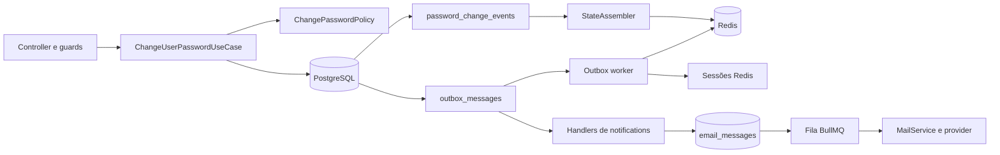

# Arquitetura da alteração de senha

## Visão geral

A feature combina uma transação PostgreSQL, uma projeção Redis e eventos de
outbox. Cada componente possui uma autoridade diferente:

- PostgreSQL guarda os fatos e a versão durável da credencial.
- Redis mantém o estado operacional usado antes do bcrypt.
- A policy calcula as regras sem acessar infraestrutura.
- O use case coordena concorrência, transação e efeitos pós-commit.
- A outbox permite repetir reconciliação, revogação e notificações.

## Camadas e componentes

| Camada         | Componentes principais                                        | Responsabilidade                                         |
| -------------- | ------------------------------------------------------------- | -------------------------------------------------------- |
| Presentation   | `AuthController`, `PasswordChangeCostGuard`                   | Autenticar, validar HTTP, limitar custo e limpar cookies |
| Application    | `ChangeUserPasswordUseCase`, loader, assembler e synchronizer | Orquestrar o fluxo e transformar fatos em estado         |
| Domain         | `PasswordChangeEvent`, `ChangePasswordPolicy`, eventos        | Representar fatos, invariantes e regras temporais        |
| Infrastructure | repository PostgreSQL, store Redis, Lua e rehydrators         | Persistir, projetar e transportar eventos                |
| Worker         | handlers de auth e notifications                              | Repetir efeitos e produzir e-mails depois do commit      |

## Fontes de estado

### `password_change_events`

Histórico append-only com falhas da senha atual, alterações concluídas e inícios
de bloqueio. Também é a fonte usada para reconstruir o Redis.

### `users.credential_version`

Versão incrementada na mesma transação que troca o hash. Tokens com versão
anterior são rejeitados independentemente da limpeza física das sessões.

### Projeção Redis

Conjunto de chaves com falhas, bloqueio, reincidência, alterações,
`initialized` e `pending`. A projeção é sempre substituída integralmente a
partir dos fatos duráveis.

### Outbox

Registra quatro responsabilidades independentes:

- reconstruir a projeção Redis;
- repetir a remoção das sessões;
- informar que a senha foi alterada;
- informar que um bloqueio foi iniciado.

## Documentos especializados

- [Fluxos](./flow/README.md)
- [Decisões](./decisions/README.md)
- [Chaves Redis](./redis-keys.md)
- [Scripts Lua](./lua-scripts.md)
- [Notificações](./notifications.md)
- [Schema PostgreSQL](../../database/schema.md)
- [Contratos de eventos](../../events/password-change.md)

## Desenho original

O
[Excalidraw original](<../../Excalidraw/Drawing 2026-07-25 13.26.52.excalidraw.md>)
registra o levantamento inicial da feature. Ele é histórico: quando houver
diferença de nomes ou detalhes, a spec aprovada e estes documentos oficiais
prevalecem.
