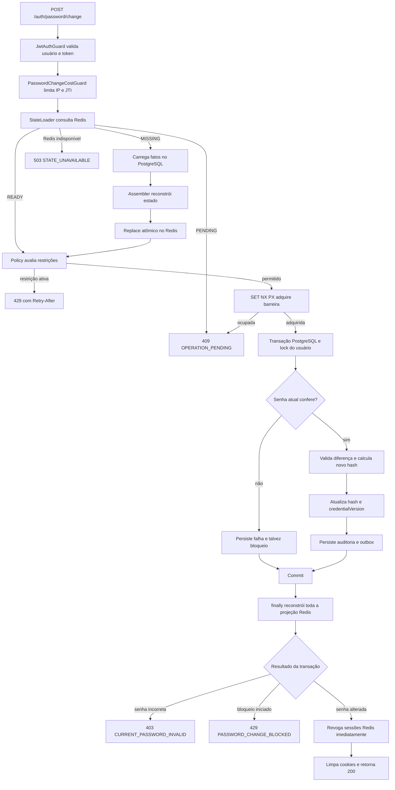
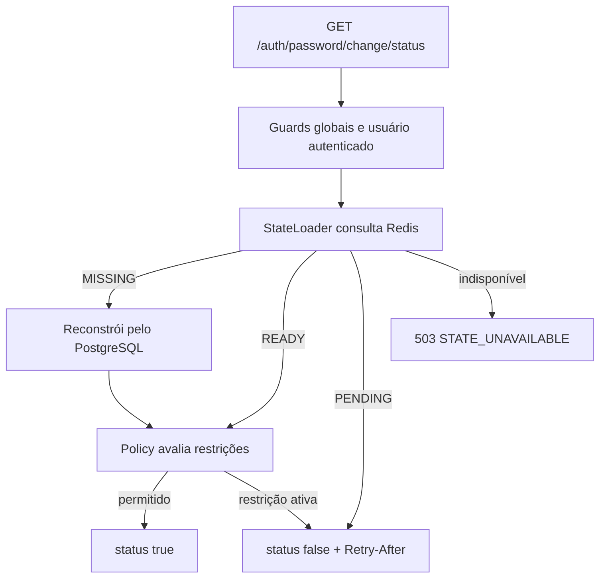

# Fluxos da alteração de senha

`POST /auth/password/change` recebe somente `currentPassword` e `newPassword`.
O usuário e o JTI do access token vêm do contexto autenticado; IP e dispositivo
são derivados da requisição e sanitizados.

`GET /auth/password/change/status` permite ao frontend consultar antecipadamente
se existe alguma restrição temporal. A resposta contém somente `status` booleano;
quando falso, `Retry-After` informa os segundos restantes sem revelar a causa.

## Cenários

- [Sucesso](./success.md): transação, reconstrução Redis e revogação de sessões.
- [Senha atual incorreta](./failed-attempts.md): contagem, primeiro bloqueio e
  reincidência.
- [Erros e restrições](./errors.md): códigos, status e condições de retry.

## Caminho principal

## Consulta de status

A consulta usa somente o throttling global. Ela não passa pelo
`PasswordChangeCostGuard`, não cria barreira e não altera o orçamento técnico do
`POST`. Como o resultado não reserva a operação, o `POST` sempre reavalia o
estado antes do bcrypt.

## Fronteiras de responsabilidade

- Guards autenticam e limitam o custo técnico antes do bcrypt.
- A rota de status autentica e consulta, mas não consome o limite técnico do
  fluxo de mutação.
- O loader entrega à policy um estado operacional confiável.
- A policy decide regras usando apenas estado e horário.
- O use case coordena barreira, transação, domínio, outbox e efeitos pós-commit.
- PostgreSQL registra fatos; Redis acelera decisões e pode ser reconstruído.
- O worker repete reconciliação e revogação quando a via imediata falha.
