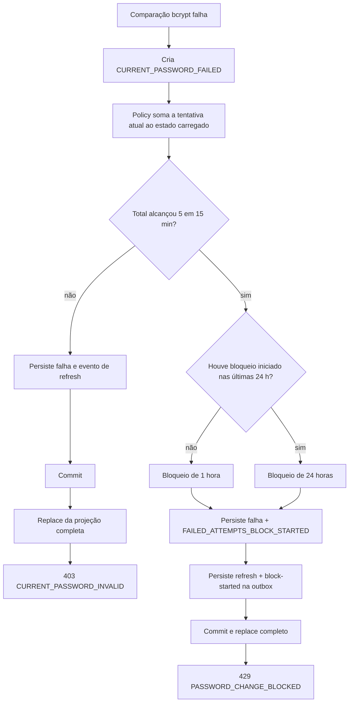

# Senha atual incorreta e bloqueios

## Falhas anteriores ao limite

Uma senha atual incorreta cria `CURRENT_PASSWORD_FAILED`. A policy recebe a
quantidade já confirmada e soma a tentativa atual antes de decidir. Enquanto o
total for menor que cinco, a transação confirma a auditoria e retorna um
resultado interno que depois vira `403 CURRENT_PASSWORD_INVALID`.

O erro é lançado somente depois do commit. Lançá-lo dentro da callback
transacional causaria rollback do evento e permitiria tentativas sem contagem.

## Quinta falha

A quinta falha na janela móvel de 15 minutos já produz um bloqueio:

- sem bloqueio iniciado nas 24 horas anteriores: duração de 1 hora;
- com bloqueio iniciado nas 24 horas anteriores: duração de 24 horas.

São confirmados `CURRENT_PASSWORD_FAILED` e
`FAILED_ATTEMPTS_BLOCK_STARTED`. A resposta é `429 PASSWORD_CHANGE_BLOCKED`
com `Retry-After`, pois a própria requisição acabou de tornar a restrição ativa.

## O que não aumenta o contador

- nova senha igual à atual;
- nova senha fora da política de entrada;
- ausência do provider `EMAIL`;
- cooldown, limite diário ou bloqueio já ativo;
- indisponibilidade técnica do Redis.

Somente falha na confirmação da senha atual representa uma tentativa de
adivinhar a credencial existente.
