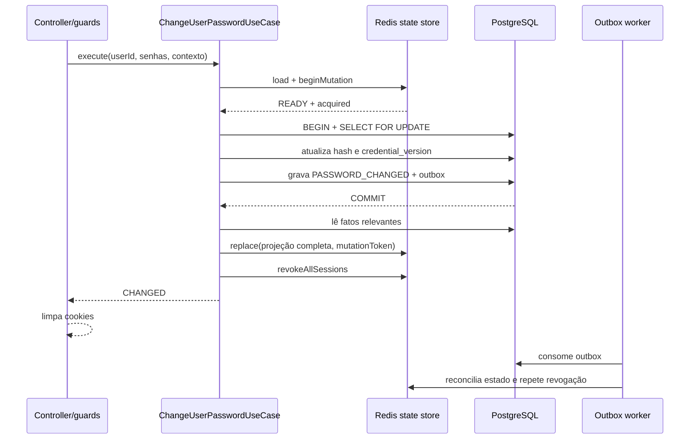

# Caminho de sucesso

## Passos

1. O loader garante um estado Redis pronto e a policy confirma que não existe
   bloqueio, cooldown ou limite diário ativo.
2. A barreira `pending` serializa a operação antes do bcrypt.
3. A transação bloqueia a linha do usuário e resolve o provider `EMAIL`.
4. A senha atual é confirmada e a nova senha precisa ser diferente.
5. O novo hash e `credentialVersion` são persistidos juntos.
6. `PASSWORD_CHANGED` e três mensagens de outbox são gravados na transação.
7. O `finally` consulta os fatos confirmados e substitui toda a projeção Redis.
8. A limpeza física das sessões é tentada imediatamente.
9. O controller limpa os cookies de access e refresh e responde `200`.

## Eventos de outbox

- `auth.password-change.state-refresh-requested`: reconciliação durável do
  Redis.
- `auth.password-change.changed`: fato destinado à futura notificação de
  segurança.
- `auth.sessions.revoke-all-requested`: retry da remoção física das sessões.

`credentialVersion` é a garantia imediata de revogação: access e refresh tokens
com versão anterior são rejeitados mesmo se a remoção no Redis falhar.

## Falhas depois do commit

- Se o `finally` falhar ou o processo encerrar, a outbox reconstrói o estado.
- Se a limpeza de sessões falhar, o evento de revogação permite retry.
- Esses erros não desfazem a senha porque o commit já estabeleceu o novo fato.
