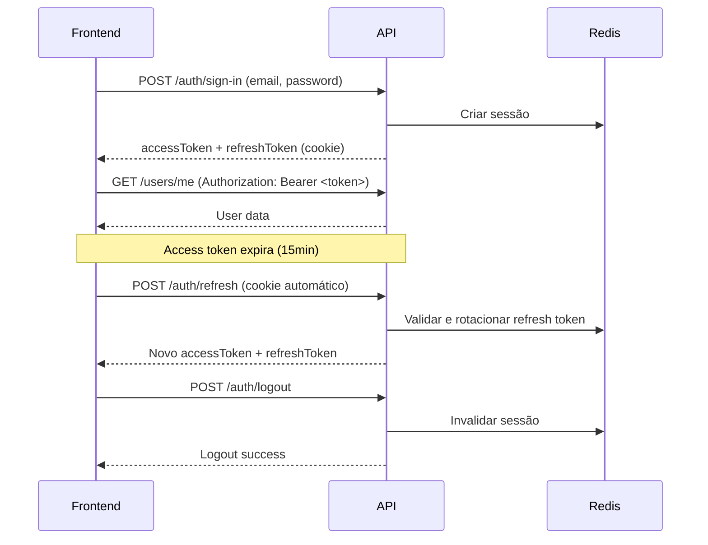

# 📘 Guia de Integração - Personal Finance API

## 🎯 Sobre Este Projeto

**Personal Finance Backend** é uma API REST desenvolvida com **NestJS** seguindo princípios rigorosos de **DDD (Domain-Driven Design)**, **Clean Architecture**, **SOLID** e padrões **Event-Driven** para gestão de finanças pessoais.

### 🏗️ Arquitetura

A aplicação segue uma arquitetura em camadas:

```
┌─────────────────────────────────────┐
│   Presentation Layer (Controllers)  │  ← HTTP/REST Interface
├─────────────────────────────────────┤
│   Application Layer (Use Cases)     │  ← Orchestration
├─────────────────────────────────────┤
│   Domain Layer (Entities, VOs)      │  ← Business Rules
├─────────────────────────────────────┤
│   Infrastructure Layer (ORM, APIs)  │  ← External Resources
└─────────────────────────────────────┘
```

### 🔑 Características Principais

- ✅ **Autenticação JWT** com refresh token rotation
- ✅ **OAuth 2.0** (Google)
- ✅ **Multi-provider authentication** (Email/Password + OAuth)
- ✅ **Session management** com Redis
- ✅ **Rate limiting** e proteção contra ataques
- ✅ **Validação robusta** com class-validator
- ✅ **Error handling** padronizado
- ✅ **API documentation** com Swagger/OpenAPI

---

## 🚀 Getting Started

### Base URL

```
Development: http://localhost:3000
Production: https://api.your-domain.com
```

### Formato de Resposta

As respostas de sucesso são **diretas por endpoint** (sem envelope fixo `data/message`).

Exemplo real de sucesso:

```json
{
  "accessToken": "<jwt>"
}
```

Exemplo de erro:

```json
{
  "statusCode": 400,
  "message": "Error description",
  "error": "Bad Request"
}
```

### Autenticação

A API usa **JWT Bearer Token** para autenticação:

```http
Authorization: Bearer <access_token>
```

**Tokens:**
- **Access Token**: Enviado no header Authorization (curta duração: 15min)
- **Refresh Token**: Armazenado em **HttpOnly Cookie** (longa duração: 7 dias)

---

## 📚 Módulos Disponíveis

### 1. [Authentication (Auth)](./auth/README.md)

Gerenciamento completo de autenticação e autorização.

**Funcionalidades:**
- Sign Up (Registro com email/senha)
- Sign In (Login com email/senha ou OAuth)
- OAuth Google (Login e Link de conta)
- Refresh Tokens (Renovação automática)
- Logout (Invalidação de tokens)
- Session Management (Gerenciar dispositivos conectados)
- Provider Linking (Vincular múltiplos métodos de login)

📖 **[Ver Documentação Completa](./auth/README.md)**

---

### 2. Users

Gerenciamento de usuários e perfis.

**Disponível hoje:**
- `GET /users/me` (dados do usuário autenticado + providers vinculados)

---

### 3. Transactions

Gerenciamento de transações financeiras.

**Status:** 🚧 Planejado

---

### 4. Categories

Categorização de transações.

**Status:** 🚧 Planejado

---

### 5. Accounts

Gerenciamento de contas bancárias/carteiras.

**Status:** 🚧 Planejado

---

## 🛡️ Segurança

### Rate Limiting

A API implementa **rate limiting** em endpoints críticos:

| Endpoint | Limite | Janela | Bloqueio |
|----------|--------|--------|----------|
| `/auth/sign-up` | 10 requisições | 10 min | 30 min |
| `/auth/sign-in` | 5 requisições | 1 min | 10 min |
| `/auth/refresh` | 5 requisições | 1 min | - |

Quando o limite é excedido:

```json
{
  "statusCode": 429,
  "message": "ThrottlerException: Too Many Requests",
  "error": "Too Many Requests"
}
```

### CORS

Configure as origens permitidas conforme o ambiente:

```typescript
// Development
origin: 'http://localhost:5173'

// Production
origin: 'https://your-frontend.com'
```

### Cookies

Refresh tokens são armazenados em **HttpOnly Cookies** com:

- `httpOnly: true` (não acessível via JavaScript)
- `secure: true` (apenas HTTPS em produção)
- `sameSite: 'lax'` (proteção CSRF)
- `path: '/auth'` (escopo limitado)

---

## 📦 Status Codes Comuns

| Código | Significado | Quando Ocorre |
|--------|-------------|---------------|
| `200` | OK | Operação bem-sucedida |
| `201` | Created | Recurso criado com sucesso |
| `204` | No Content | Operação bem-sucedida sem retorno |
| `400` | Bad Request | Dados de entrada inválidos |
| `401` | Unauthorized | Token ausente, inválido ou expirado |
| `403` | Forbidden | Sem permissão para acessar recurso |
| `404` | Not Found | Recurso não encontrado |
| `409` | Conflict | Conflito (ex: email já cadastrado) |
| `422` | Unprocessable Entity | Validação de negócio falhou |
| `429` | Too Many Requests | Rate limit excedido |
| `500` | Internal Server Error | Erro no servidor |

---

## 🧪 Testando a API

### Swagger UI

Acesse a documentação interativa:

```
http://localhost:3000/docs
```

### Postman Collection

Importe a collection Postman disponível em:

```
/docs/postman/personal-finance-api.json
```

### Exemplo com cURL

```bash
# Sign Up
curl -X POST http://localhost:3000/auth/sign-up \
  -H "Content-Type: application/json" \
  -d '{
    "email": "user@example.com",
    "password": "senha123",
    "userName": "john_doe"
  }'

# Sign In
curl -X POST http://localhost:3000/auth/sign-in \
  -H "Content-Type: application/json" \
  -d '{
    "email": "user@example.com",
    "password": "senha123"
  }'

# Acessar rota protegida
curl -X GET http://localhost:3000/users/me \
  -H "Authorization: Bearer <access_token>"
```

---

## 🔄 Fluxo de Autenticação Típico



---

## 📞 Suporte

Para dúvidas ou problemas, consulte:

1. **Swagger Docs**: `http://localhost:3000/docs`
2. **Repositório**: [GitHub Issues](#)
3. **Documentação por módulo**: Navegue pelos diretórios deste guia

---

## 🗂️ Estrutura desta Documentação

```
docs/integrations/
├── README.md                    ← Você está aqui
├── auth/
│   ├── README.md                ← Overview do módulo Auth
│   ├── sign-up.md               ← POST /auth/sign-up
│   ├── sign-in.md               ← POST /auth/sign-in
│   ├── oauth-google.md          ← OAuth Google Flow
│   ├── refresh-tokens.md        ← POST /auth/refresh
│   ├── logout.md                ← POST /auth/logout
│   ├── get-me.md                ← GET /users/me
│   ├── sessions.md              ← Gerenciar sessões
│   └── link-providers.md        ← Vincular providers
├── users/
│   └── README.md                🚧 Em breve
└── transactions/
    └── README.md                🚧 Em breve
```

---

**Última atualização:** 2026-04-12  
**Versão da API:** 1.0.0  
**Documentação mantida por:** Backend Team
