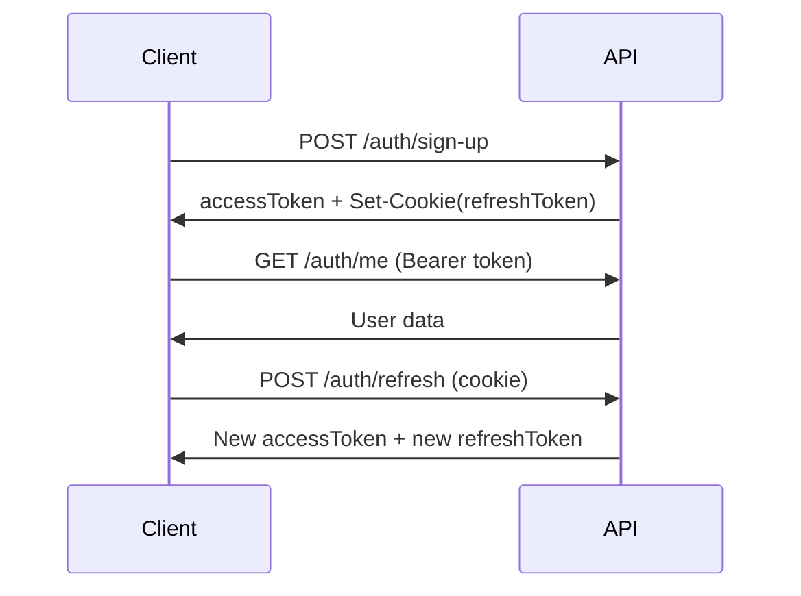
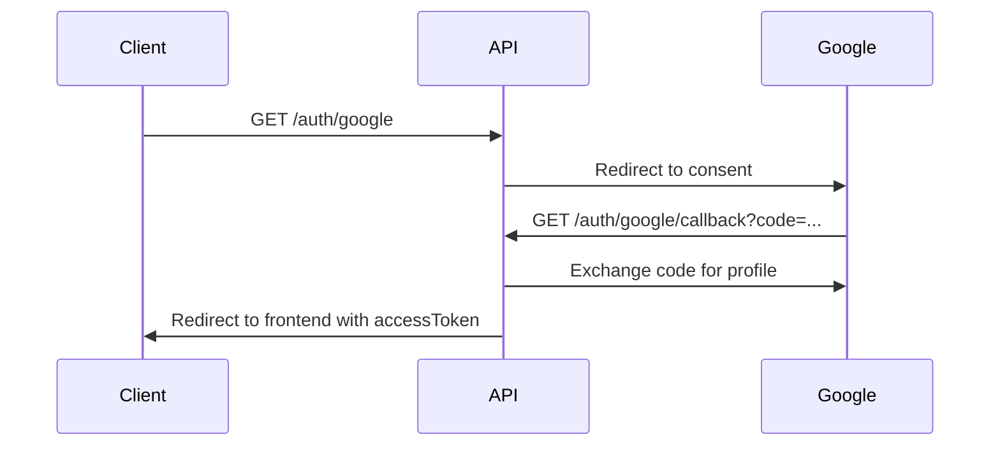

# 🔐 Módulo de Autenticação - Personal Finance API

## 📋 Overview

O módulo de autenticação fornece endpoints completos para gerenciamento de usuários, autenticação e autorização. Suporta múltiplos providers (Email/Senha e Google OAuth) e implementa um sistema robusto de sessões com refresh token rotation.

## 🌟 Recursos

- ✅ Registro e login com email/senha
- ✅ Login social com Google OAuth 2.0
- ✅ JWT (Access Token) + HttpOnly Cookies (Refresh Token)
- ✅ Refresh Token Rotation para segurança aprimorada
- ✅ Gerenciamento de múltiplas sessões ativas
- ✅ Vinculação de providers (adicionar email a conta Google e vice-versa)
- ✅ Rate limiting por endpoint
- ✅ Rastreamento de sessões com metadata (IP, dispositivo, localização)

## 🔗 Endpoints Disponíveis

### 👤 Gerenciamento de Usuário
- [`GET /auth/me`](./get-me.md) - Obter dados do usuário autenticado

### 🔑 Autenticação com Email
- [`POST /auth/sign-up`](./sign-up.md) - Criar nova conta com email/senha
- [`POST /auth/sign-in`](./sign-in.md) - Login com email/senha

### 🔐 Autenticação OAuth Google
- [`GET /auth/google`](./oauth-google.md#iniciar-login) - Iniciar login com Google
- [`GET /auth/google/callback`](./oauth-google.md#callback) - Callback OAuth Google

### 🔄 Gerenciamento de Tokens
- [`POST /auth/refresh`](./refresh-tokens.md) - Renovar access token
- [`POST /auth/logout`](./logout.md) - Encerrar sessão atual

### 📱 Gerenciamento de Sessões
- [`GET /auth/sessions`](./sessions.md#listar-sessoes) - Listar todas as sessões ativas
- [`DELETE /auth/sessions/:jti`](./sessions.md#revogar-sessao) - Revogar sessão específica

### 🔗 Vinculação de Providers
- [`POST /auth/providers/link/email`](./link-providers.md#vincular-email) - Adicionar email/senha a conta
- [`GET /auth/providers/link/google`](./link-providers.md#vincular-google) - Iniciar vinculação Google
- [`GET /auth/providers/link/google/callback`](./link-providers.md#callback-google) - Callback vinculação Google

## 🛡️ Segurança

### Tokens JWT
- **Access Token**: JWT assinado com HS256, expira em 15 minutos
- **Refresh Token**: JWT assinado com HS256, expira em 7 dias, armazenado em HttpOnly cookie

### Rate Limiting
- **Sign Up**: 10 requisições a cada 10 minutos (bloqueio de 30 min)
- **Sign In**: 5 requisições por minuto (bloqueio de 10 min)
- **Refresh**: 5 requisições por minuto
- **Google OAuth**: 5 requisições por minuto

### Cookies HttpOnly
```
refreshToken=<token>; 
Path=/auth; 
HttpOnly; 
Secure (em produção); 
SameSite=Lax (produção) / None (dev)
Max-Age=604800 (7 dias)
```

## 🔐 Autenticação

A maioria dos endpoints requer autenticação via **Bearer Token**:

```bash
Authorization: Bearer <access_token>
```

## 📊 Códigos de Status HTTP

| Código | Significado |
|--------|-------------|
| `200` | Sucesso |
| `201` | Recurso criado |
| `204` | Sucesso sem conteúdo |
| `400` | Dados inválidos |
| `401` | Não autenticado ou token inválido |
| `404` | Recurso não encontrado |
| `409` | Conflito (ex: email já cadastrado) |
| `422` | Entidade não processável |
| `429` | Muitas requisições (rate limit) |
| `500` | Erro interno do servidor |

## 🌐 Base URL

```
Development: http://localhost:3000
Production: https://api.personalfinance.com
```

## 📖 Exemplos Rápidos

### Criar conta e fazer login
```bash
# 1. Criar conta
curl -X POST http://localhost:3000/auth/sign-up \
  -H "Content-Type: application/json" \
  -d '{
    "userName": "john_doe",
    "email": "john@example.com",
    "password": "senha123",
    "firstName": "John",
    "lastName": "Doe"
  }'

# 2. Obter dados do usuário
curl http://localhost:3000/auth/me \
  -H "Authorization: Bearer <access_token>"
```

### Login com Google
```bash
# Redirecionar usuário para:
http://localhost:3000/auth/google
```

## 🔄 Fluxo de Autenticação

### Email/Senha


### Google OAuth


## 📝 Notas Importantes

1. **Refresh Token Rotation**: Cada vez que você usa o refresh token, ele é invalidado e um novo é gerado
2. **Múltiplas Sessões**: Um usuário pode ter várias sessões ativas simultaneamente
3. **Revogação de Sessão**: Revogar uma sessão invalida apenas aquele refresh token específico
4. **Logout**: Invalida AMBOS access e refresh token da sessão atual
5. **Providers**: Usuários podem ter múltiplos providers vinculados (email + Google)

## 🚀 Começando

1. Escolha o método de autenticação:
   - [Email/Senha](./sign-up.md) - Para registro tradicional
   - [Google OAuth](./oauth-google.md) - Para login social

2. Armazene o access token retornado

3. Use o access token em requisições protegidas:
   ```
   Authorization: Bearer <access_token>
   ```

4. Quando o access token expirar (15 min), use [refresh](./refresh-tokens.md)

5. Para encerrar a sessão, use [logout](./logout.md)

## 📚 Documentação Detalhada

Clique nos links acima para ver documentação completa de cada endpoint, incluindo:
- Exemplos de requisição e resposta
- Todos os possíveis códigos de erro
- Validações de campos
- Exemplos em cURL, JavaScript e TypeScript
