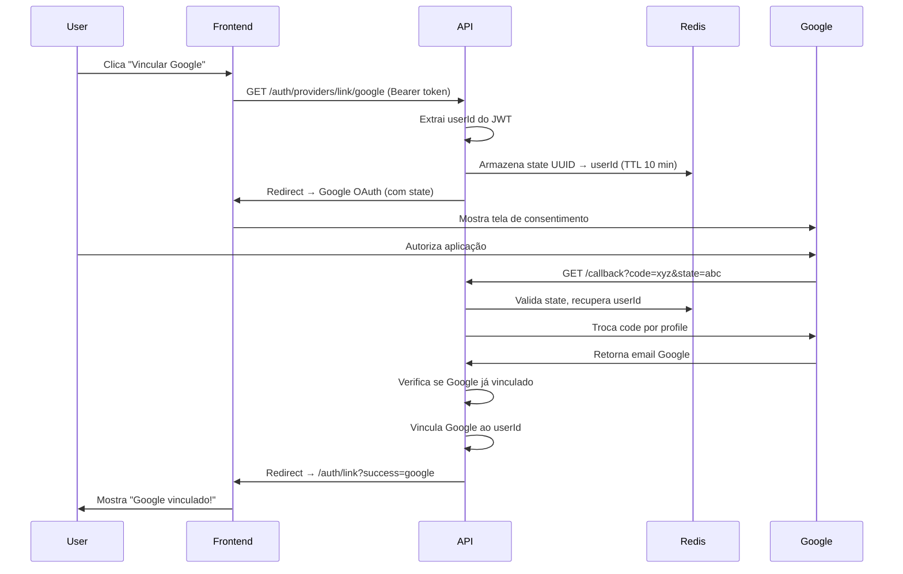

# 🔗 Vinculação de Providers

## 📋 Overview

Permite que usuários adicionem múltiplos métodos de autenticação à mesma conta. Por exemplo:
- Usuário criado com Google pode adicionar email/senha
- Usuário criado com email pode adicionar login via Google

Isso oferece flexibilidade e segurança adicional aos usuários.

---

## 1️⃣ POST /auth/providers/link/email
### Vincular Email/Senha

### 📋 Descrição

Adiciona autenticação por email/senha a uma conta existente. Útil quando o usuário criou a conta via Google OAuth e deseja adicionar login tradicional.

### 🔐 Autenticação

✅ **Requer autenticação** via Bearer Token

```
Authorization: Bearer <access_token>
```

### ⚡ Rate Limiting

❌ Não possui rate limiting específico

### 📨 Request

#### Método e URL
```
POST /auth/providers/link/email
```

#### Headers
```
Authorization: Bearer <access_token>
Content-Type: application/json
```

#### Body Parameters

| Campo | Tipo | Obrigatório | Validação | Descrição |
|-------|------|-------------|-----------|-----------|
| `email` | string | ✅ Sim | Email válido | Email a ser vinculado |
| `password` | string | ✅ Sim | 6-50 caracteres | Senha para login futuro |

#### Exemplo de Body
```json
{
  "email": "joao.silva@email.com",
  "password": "senhaSegura123"
}
```

### ✅ Response de Sucesso

#### Status Code
```
200 OK
```

#### Headers
```
Content-Type: application/json
```

#### Body
```json
{
  "message": "Email provider linked successfully"
}
```

### ❌ Possíveis Erros

#### 400 Bad Request
**Quando ocorre**: Dados inválidos

```json
{
  "statusCode": 400,
  "message": [
    "This email address is not a valid address.",
    "The password must be between 6 and 50 characters long."
  ],
  "error": "Bad Request"
}
```

#### 401 Unauthorized
**Quando ocorre**: Token inválido ou expirado

```json
{
  "statusCode": 401,
  "message": "Unauthorized",
  "error": "Unauthorized"
}
```

#### 409 Conflict
**Quando ocorre**: 
- Usuário já possui provider de email
- Email já está cadastrado em outra conta

**Cenário 1: Já possui email**
```json
{
  "statusCode": 409,
  "message": "User already has an email provider",
  "error": "Conflict"
}
```

**Cenário 2: Email em uso**
```json
{
  "statusCode": 409,
  "message": "Email already registered",
  "error": "Conflict"
}
```

#### 500 Internal Server Error
```json
{
  "statusCode": 500,
  "message": "Internal server error",
  "error": "Internal Server Error"
}
```

### 💡 Exemplos de Uso

#### cURL
```bash
ACCESS_TOKEN="eyJhbGciOiJIUzI1NiIsInR5cCI6IkpXVCJ9..."

curl -X POST http://localhost:3000/auth/providers/link/email \
  -H "Authorization: Bearer $ACCESS_TOKEN" \
  -H "Content-Type: application/json" \
  -d '{
    "email": "joao.silva@email.com",
    "password": "senhaSegura123"
  }'
```

#### JavaScript (fetch)
```javascript
async function linkEmailProvider(email, password) {
  try {
    const accessToken = localStorage.getItem('accessToken');

    const response = await fetch('http://localhost:3000/auth/providers/link/email', {
      method: 'POST',
      headers: {
        'Authorization': `Bearer ${accessToken}`,
        'Content-Type': 'application/json',
      },
      body: JSON.stringify({ email, password })
    });

    if (!response.ok) {
      const error = await response.json();
      
      if (response.status === 409) {
        throw new Error('Email já cadastrado ou você já possui login por email');
      }
      
      throw new Error(error.message || 'Erro ao vincular email');
    }

    const data = await response.json();
    console.log(data.message);
    return data;
    
  } catch (error) {
    console.error('Erro:', error.message);
    throw error;
  }
}

// Uso
linkEmailProvider('joao.silva@email.com', 'senhaSegura123')
  .then(() => {
    alert('Email vinculado com sucesso! Agora você pode fazer login com email/senha.');
  });
```

#### TypeScript (axios)
```typescript
import axios, { AxiosError } from 'axios';

interface LinkEmailRequest {
  email: string;
  password: string;
}

interface LinkEmailResponse {
  message: string;
}

async function linkEmailProvider(data: LinkEmailRequest): Promise<void> {
  try {
    const accessToken = localStorage.getItem('accessToken');

    const response = await axios.post<LinkEmailResponse>(
      'http://localhost:3000/auth/providers/link/email',
      data,
      {
        headers: {
          'Authorization': `Bearer ${accessToken}`,
          'Content-Type': 'application/json',
        },
      }
    );

    console.log(response.data.message);
    
  } catch (error) {
    if (axios.isAxiosError(error)) {
      const axiosError = error as AxiosError<{ message: string }>;
      
      if (axiosError.response?.status === 409) {
        throw new Error('Email já cadastrado ou provider já vinculado');
      }
      
      throw new Error(axiosError.response?.data?.message || 'Erro ao vincular email');
    }
    
    throw error;
  }
}

// Uso
linkEmailProvider({
  email: 'joao.silva@email.com',
  password: 'senhaSegura123'
})
  .then(() => console.log('Email vinculado!'))
  .catch(error => console.error(error.message));
```

#### React Component
```typescript
import { useState } from 'react';
import axios from 'axios';

function LinkEmailForm() {
  const [email, setEmail] = useState('');
  const [password, setPassword] = useState('');
  const [loading, setLoading] = useState(false);
  const [error, setError] = useState('');
  const [success, setSuccess] = useState(false);

  const handleSubmit = async (e: React.FormEvent) => {
    e.preventDefault();
    setLoading(true);
    setError('');

    try {
      const accessToken = localStorage.getItem('accessToken');
      
      await axios.post(
        'http://localhost:3000/auth/providers/link/email',
        { email, password },
        {
          headers: {
            'Authorization': `Bearer ${accessToken}`,
            'Content-Type': 'application/json',
          },
        }
      );

      setSuccess(true);
      setEmail('');
      setPassword('');
      
    } catch (err: any) {
      setError(err.response?.data?.message || 'Erro ao vincular email');
    } finally {
      setLoading(false);
    }
  };

  if (success) {
    return (
      <div className="success-message">
        ✅ Email vinculado com sucesso! Agora você pode fazer login com email/senha.
      </div>
    );
  }

  return (
    <form onSubmit={handleSubmit}>
      <h3>Adicionar Login com Email</h3>
      
      {error && <div className="error">{error}</div>}
      
      <input
        type="email"
        placeholder="Email"
        value={email}
        onChange={e => setEmail(e.target.value)}
        required
      />
      
      <input
        type="password"
        placeholder="Senha (mín. 6 caracteres)"
        value={password}
        onChange={e => setPassword(e.target.value)}
        minLength={6}
        required
      />
      
      <button type="submit" disabled={loading}>
        {loading ? 'Vinculando...' : 'Vincular Email'}
      </button>
    </form>
  );
}
```

---

## 2️⃣ GET /auth/providers/link/google
### Vincular Google (Iniciar)

### 📋 Descrição

Inicia o fluxo OAuth para vincular uma conta Google a um usuário já autenticado. Similar ao login com Google, mas vincula a uma conta existente ao invés de criar/logar.

### 🔐 Autenticação

✅ **Requer autenticação** via Bearer Token

```
Authorization: Bearer <access_token>
```

### 📨 Request

#### Método e URL
```
GET /auth/providers/link/google
```

#### Headers
```
Authorization: Bearer <access_token>
```

### ✅ Response de Sucesso

#### Status Code
```
302 Found (Redirect)
```

#### Headers
```
Location: https://accounts.google.com/o/oauth2/v2/auth?
  client_id=<google_client_id>&
  redirect_uri=<api_url>/auth/providers/link/google/callback&
  response_type=code&
  scope=email profile&
  state=<uuid>
```

O navegador é redirecionado para a tela de consentimento do Google.

### 💡 Exemplo de Uso

#### HTML/JavaScript
```html
<button onclick="linkGoogle()">
  
  Vincular conta Google
</button>

<script>
function linkGoogle() {
  const accessToken = localStorage.getItem('accessToken');
  
  // Redirecionar com token no header é complicado via navegador
  // Melhor abordagem: usar popup ou nova aba
  
  const width = 500;
  const height = 600;
  const left = (screen.width / 2) - (width / 2);
  const top = (screen.height / 2) - (height / 2);
  
  const popup = window.open(
    `http://localhost:3000/auth/providers/link/google`,
    'Link Google',
    `width=${width},height=${height},left=${left},top=${top}`
  );
  
  // Listener para quando popup fechar/completar
  const interval = setInterval(() => {
    if (popup.closed) {
      clearInterval(interval);
      // Verificar se vinculação foi bem sucedida
      checkLinkStatus();
    }
  }, 500);
}

async function checkLinkStatus() {
  // Verificar se Google foi vinculado
  const user = await getCurrentUser();
  if (user.hasGoogleProvider) {
    alert('Google vinculado com sucesso!');
  }
}
</script>
```

#### React Component
```typescript
function LinkGoogleButton() {
  const handleLinkGoogle = () => {
    const width = 500;
    const height = 600;
    const left = (screen.width / 2) - (width / 2);
    const top = (screen.height / 2) - (height / 2);
    
    const popup = window.open(
      'http://localhost:3000/auth/providers/link/google',
      'Link Google Account',
      `width=${width},height=${height},left=${left},top=${top}`
    );
    
    // Escutar mensagem do callback
    window.addEventListener('message', (event) => {
      if (event.origin !== window.location.origin) return;
      
      if (event.data.type === 'google-link-success') {
        popup?.close();
        toast.success('Google vinculado com sucesso!');
        // Atualizar dados do usuário
        refetchUser();
      } else if (event.data.type === 'google-link-error') {
        popup?.close();
        toast.error('Erro ao vincular Google: ' + event.data.error);
      }
    });
  };

  return (
    <button onClick={handleLinkGoogle} className="google-btn">
      <GoogleIcon />
      Vincular conta Google
    </button>
  );
}
```

---

## 3️⃣ GET /auth/providers/link/google/callback
### Vincular Google (Callback)

### 📋 Descrição

Endpoint de callback do fluxo OAuth de vinculação. O Google redireciona para este endpoint após o usuário autorizar.

### 🔐 Autenticação

❌ Não requer autenticação no header (state contém validação)

### 📨 Request

#### Método e URL
```
GET /auth/providers/link/google/callback
```

#### Query Parameters

| Parâmetro | Tipo | Descrição |
|-----------|------|-----------|
| `code` | string | Código de autorização do Google |
| `state` | string | State UUID (contém userId criptografado) |

> ⚠️ **Nota**: Este endpoint NÃO é chamado diretamente. O Google redireciona automaticamente.

### ✅ Response de Sucesso

#### Status Code
```
302 Found (Redirect)
```

#### Headers
```
Location: <frontend_url>/auth/link?success=google
```

### ❌ Possíveis Erros

**Cenário 1: Google já vinculado a outra conta**
```
Redirect: <frontend_url>/auth/link?error=google_already_linked
```

**Cenário 2: Usuário já possui Google**
```
Redirect: <frontend_url>/auth/link?error=user_already_has_google
```

**Cenário 3: State inválido**
```
Redirect: <frontend_url>/auth/link?error=invalid_state
```

**Cenário 4: Código inválido**
```
Redirect: <frontend_url>/auth/link?error=invalid_code
```

### 💡 Frontend - Capturar Resultado

#### React Router
```typescript
import { useEffect } from 'react';
import { useSearchParams, useNavigate } from 'react-router-dom';

function LinkCallback() {
  const [searchParams] = useSearchParams();
  const navigate = useNavigate();

  useEffect(() => {
    const success = searchParams.get('success');
    const error = searchParams.get('error');

    if (success === 'google') {
      // Notificar janela pai (se foi aberta em popup)
      if (window.opener) {
        window.opener.postMessage(
          { type: 'google-link-success' },
          window.location.origin
        );
        window.close();
      } else {
        // Redirecionar com mensagem de sucesso
        navigate('/settings?message=google_linked');
      }
    } else if (error) {
      const errorMessages = {
        google_already_linked: 'Esta conta Google já está vinculada a outro usuário',
        user_already_has_google: 'Você já possui uma conta Google vinculada',
        invalid_state: 'Sessão expirada. Tente novamente.',
        invalid_code: 'Erro ao validar com Google. Tente novamente.',
      };

      const message = errorMessages[error] || 'Erro desconhecido';

      if (window.opener) {
        window.opener.postMessage(
          { type: 'google-link-error', error: message },
          window.location.origin
        );
        window.close();
      } else {
        navigate('/settings?error=' + error);
      }
    }
  }, [searchParams, navigate]);

  return (
    <div>
      <p>Processando vinculação...</p>
    </div>
  );
}
```

---

## 🔄 Fluxo Completo de Vinculação Google



---

## 🔒 Notas de Segurança

### 1. State Parameter
- Contém userId criptografado
- Armazenado em Redis com TTL de 10 minutos
- Validado no callback para prevenir CSRF
- Garante que a vinculação é para o usuário correto

### 2. Validações
```typescript
// Backend valida:
1. JWT válido no início do fluxo
2. State válido no callback
3. Google account não vinculado a outra conta
4. Usuário não possui Google já vinculado
5. Code válido do Google
```

### 3. Unicidade
- Um email Google só pode estar vinculado a UMA conta
- Um usuário só pode ter UM provider Google
- Validações no banco de dados (unique constraints)

### 4. Isolamento de Sessão
- Vinculação não cria nova sessão
- Não gera novos tokens
- Apenas adiciona provider ao usuário existente

---

## 💡 Casos de Uso

### 1. Página de Configurações
```typescript
function AccountSettings() {
  const { user } = useAuth();

  return (
    <div>
      <h2>Métodos de Login</h2>
      
      <div className="provider-list">
        {/* Email Provider */}
        <div className="provider-item">
          <EmailIcon />
          <span>Email/Senha</span>
          {user.hasEmailProvider ? (
            <span className="badge-success">Ativo</span>
          ) : (
            <LinkEmailForm />
          )}
        </div>
        
        {/* Google Provider */}
        <div className="provider-item">
          <GoogleIcon />
          <span>Google</span>
          {user.hasGoogleProvider ? (
            <span className="badge-success">Vinculado</span>
          ) : (
            <LinkGoogleButton />
          )}
        </div>
      </div>
    </div>
  );
}
```

### 2. Sugestão Pós-Login
```typescript
function WelcomeDashboard() {
  const { user } = useAuth();

  // Se usuário só tem 1 provider, sugerir adicionar outro
  const providersCount = 
    (user.hasEmailProvider ? 1 : 0) + 
    (user.hasGoogleProvider ? 1 : 0);

  if (providersCount === 1) {
    return (
      <div className="suggestion-banner">
        <h3>🔒 Proteja sua conta</h3>
        <p>Adicione outro método de login para mais segurança</p>
        
        {!user.hasEmailProvider && <LinkEmailForm />}
        {!user.hasGoogleProvider && <LinkGoogleButton />}
      </div>
    );
  }

  return <Dashboard />;
}
```

### 3. Recuperação de Acesso
```typescript
// Se usuário perdeu acesso ao Google, pode usar email/senha
// Se esqueceu a senha, pode usar Google
function LoginPage() {
  return (
    <div>
      <h2>Login</h2>
      
      <EmailLoginForm />
      
      <div className="divider">OU</div>
      
      <GoogleLoginButton />
      
      <p className="help-text">
        Você pode fazer login com qualquer método vinculado à sua conta
      </p>
    </div>
  );
}
```

---

## 🔗 Endpoints Relacionados

- [`POST /auth/sign-up`](./sign-up.md) - Criar conta inicial
- [`GET /auth/google`](./oauth-google.md) - Login com Google (não vincular)
- [`GET /auth/me`](./get-me.md) - Ver providers vinculados
- [`POST /auth/logout`](./logout.md) - Logout (funciona com qualquer provider)
