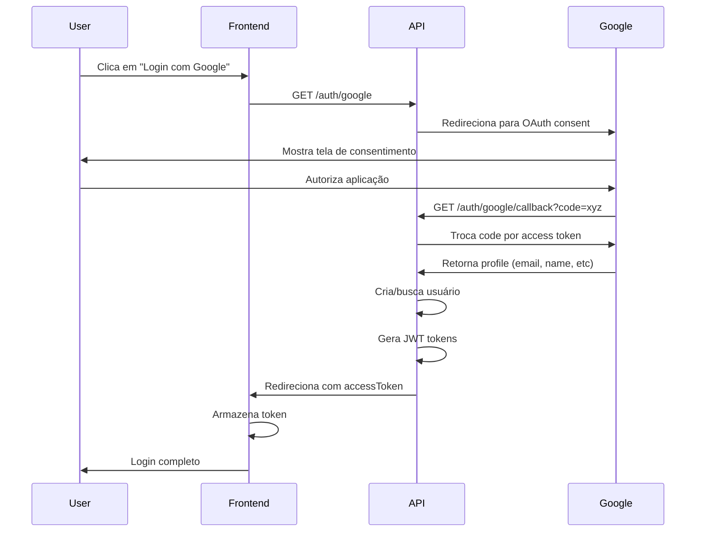

# 🔐 Login com Google OAuth 2.0

## 📋 Overview

Implementação completa do fluxo OAuth 2.0 do Google para autenticação. O usuário é redirecionado para a página de consentimento do Google e, após autorização, retorna com os tokens de acesso.

## 🔄 Fluxo Completo



---

## 1️⃣ GET /auth/google
### Iniciar Login com Google

### 📋 Descrição

Inicia o fluxo OAuth 2.0, redirecionando o usuário para a página de consentimento do Google.

### 🔐 Autenticação

❌ Não requer autenticação

### ⚡ Rate Limiting

- **Limite**: 5 requisições por minuto
- **Bloqueio**: Temporário após exceder

### 📨 Request

#### Método e URL
```
GET /auth/google
```

#### Headers
Não requer headers especiais.

#### Query Parameters
Não requer parâmetros (são gerados automaticamente pelo backend).

### ✅ Response de Sucesso

#### Status Code
```
302 Found (Redirect)
```

#### Headers
```
Location: https://accounts.google.com/o/oauth2/v2/auth?
  client_id=<google_client_id>&
  redirect_uri=<callback_url>&
  response_type=code&
  scope=email profile&
  access_type=offline&
  prompt=consent
```

#### Body
Não há body. O navegador é redirecionado automaticamente.

### 💡 Exemplo de Uso

#### HTML/JavaScript
```html
<button onclick="loginWithGoogle()">
  
  Continuar com Google
</button>

<script>
function loginWithGoogle() {
  // Simplesmente redirecionar para o endpoint
  window.location.href = 'http://localhost:3000/auth/google';
}
</script>
```

#### React Component
```typescript
function GoogleLoginButton() {
  const handleGoogleLogin = () => {
    window.location.href = 'http://localhost:3000/auth/google';
  };

  return (
    <button onClick={handleGoogleLogin} className="google-btn">
      
      Continuar com Google
    </button>
  );
}
```

#### Link direto
```html
<a href="http://localhost:3000/auth/google">
  Login com Google
</a>
```

---

## 2️⃣ GET /auth/google/callback
### Callback OAuth Google

### 📋 Descrição

Endpoint de callback do Google OAuth. O Google redireciona para este endpoint com um código de autorização, que é trocado por um access token e informações do perfil do usuário.

### 🔐 Autenticação

❌ Não requer autenticação (código vem do Google)

### 📨 Request

#### Método e URL
```
GET /auth/google/callback
```

#### Query Parameters

| Parâmetro | Tipo | Descrição |
|-----------|------|-----------|
| `code` | string | Código de autorização do Google |
| `state` | string | State para validação CSRF (gerado pelo backend) |

**Exemplo**:
```
GET /auth/google/callback?code=4/0AX4XfWi...&state=abc123
```

> ⚠️ **Nota**: Você NÃO chama este endpoint diretamente. O Google redireciona automaticamente.

### ✅ Response de Sucesso

#### Status Code
```
302 Found (Redirect)
```

#### Headers
```
Location: <frontend_url>/auth/callback?accessToken=<jwt_token>
Set-Cookie: refreshToken=<jwt_token>; Path=/auth; HttpOnly; Secure; SameSite=Lax; Max-Age=604800
```

#### Redirecionamento
O usuário é redirecionado para o frontend com o access token na URL:

```
https://app.personalfinance.com/auth/callback?accessToken=eyJhbGciOiJIUzI1NiIsInR5cCI6IkpXVCJ9...
```

### ❌ Possíveis Erros

#### 401 Unauthorized
**Quando ocorre**: 
- Código de autorização inválido
- State inválido (possível ataque CSRF)
- Usuário negou permissão

```
Redirect: <frontend_url>/auth/callback?error=unauthorized
```

#### 500 Internal Server Error
**Quando ocorre**: Erro ao comunicar com Google ou criar usuário

```
Redirect: <frontend_url>/auth/callback?error=server_error
```

---

## 🌐 Frontend - Capturar Token

Após o callback, o usuário é redirecionado para o frontend com o token na URL. Você precisa capturá-lo:

### React Router
```typescript
import { useEffect } from 'react';
import { useNavigate, useSearchParams } from 'react-router-dom';

function AuthCallback() {
  const [searchParams] = useSearchParams();
  const navigate = useNavigate();

  useEffect(() => {
    const accessToken = searchParams.get('accessToken');
    const error = searchParams.get('error');

    if (error) {
      console.error('Erro no login:', error);
      navigate('/login?error=' + error);
      return;
    }

    if (accessToken) {
      // Armazenar token
      localStorage.setItem('accessToken', accessToken);
      
      // Redirecionar para dashboard
      navigate('/dashboard');
    } else {
      navigate('/login');
    }
  }, [searchParams, navigate]);

  return (
    <div>
      <p>Processando login com Google...</p>
    </div>
  );
}

export default AuthCallback;
```

### Next.js
```typescript
import { useEffect } from 'react';
import { useRouter } from 'next/router';

export default function AuthCallback() {
  const router = useRouter();

  useEffect(() => {
    const { accessToken, error } = router.query;

    if (error) {
      console.error('Erro:', error);
      router.push('/login');
      return;
    }

    if (accessToken && typeof accessToken === 'string') {
      localStorage.setItem('accessToken', accessToken);
      router.push('/dashboard');
    }
  }, [router.query]);

  return <div>Finalizando login...</div>;
}
```

### Vanilla JavaScript
```javascript
// Página: /auth/callback

window.addEventListener('DOMContentLoaded', () => {
  const urlParams = new URLSearchParams(window.location.search);
  const accessToken = urlParams.get('accessToken');
  const error = urlParams.get('error');

  if (error) {
    alert('Erro ao fazer login: ' + error);
    window.location.href = '/login';
    return;
  }

  if (accessToken) {
    localStorage.setItem('accessToken', accessToken);
    window.location.href = '/dashboard';
  } else {
    window.location.href = '/login';
  }
});
```

---

## 🔒 Fluxo Detalhado

### 1. Usuário inicia login
```
User clicks "Login com Google"
  ↓
Frontend: window.location.href = '/auth/google'
```

### 2. Backend redireciona para Google
```
Backend generates OAuth URL with:
  - client_id: <google_client_id>
  - redirect_uri: <api_url>/auth/google/callback
  - scope: email profile
  - state: <random_uuid> (CSRF protection)
  ↓
Redirect 302 → Google OAuth consent screen
```

### 3. Google mostra tela de consentimento
```
User sees Google login page
User selects account
User grants permissions (email, profile)
```

### 4. Google redireciona com código
```
Google → GET /auth/google/callback?code=xyz&state=abc
```

### 5. Backend troca código por perfil
```
Backend:
  1. Validates state (CSRF)
  2. Exchanges code for Google access token
  3. Fetches user profile from Google
  4. Creates user if not exists
  5. Generates JWT tokens
  6. Sets refresh token cookie
  7. Redirects to frontend with access token
```

### 6. Frontend recebe token
```
Frontend → /auth/callback?accessToken=jwt
Frontend stores token
Frontend redirects to dashboard
```

---

## 🔒 Notas de Segurança

### 1. State Parameter (CSRF Protection)
- Backend gera UUID aleatório antes de redirecionar
- State é validado no callback
- Previne ataques Cross-Site Request Forgery

### 2. Redirect URI Whitelist
- Google valida redirect URI
- Deve estar configurado no Google Cloud Console
- Previne redirecionamentos maliciosos

### 3. HTTPS Required (Produção)
- Google exige HTTPS para redirect URI em produção
- Cookies Secure ativos
- Proteção contra man-in-the-middle

### 4. Scopes Mínimos
```
scope=email profile
```
- Apenas email e perfil básico
- Princípio do menor privilégio
- Usuário vê exatamente o que está autorizando

### 5. Token em URL
- Access token na URL é seguro para SPA
- Apenas por alguns segundos (durante redirect)
- Imediatamente movido para localStorage
- Refresh token NUNCA na URL (sempre cookie HttpOnly)

---

## ⚙️ Configuração do Google Cloud

### 1. Criar projeto no Google Cloud Console
```
https://console.cloud.google.com/
```

### 2. Habilitar Google+ API
```
APIs & Services → Library → Google+ API → Enable
```

### 3. Criar credenciais OAuth 2.0
```
APIs & Services → Credentials → Create Credentials → OAuth 2.0 Client ID
```

### 4. Configurar redirect URIs
```
Authorized redirect URIs:
  - http://localhost:3000/auth/google/callback (dev)
  - https://api.personalfinance.com/auth/google/callback (prod)
```

### 5. Obter credenciais
```
Client ID: <your_client_id>
Client Secret: <your_client_secret>
```

### 6. Configurar no backend (.env)
```bash
GOOGLE_CLIENT_ID=<your_client_id>
GOOGLE_CLIENT_SECRET=<your_client_secret>
GOOGLE_CALLBACK_URL=http://localhost:3000/auth/google/callback
```

---

## 🎨 UI Examples

### Botão Google (Material Design)
```tsx
import { FcGoogle } from 'react-icons/fc';

function GoogleButton() {
  return (
    <button
      onClick={() => window.location.href = 'http://localhost:3000/auth/google'}
      className="flex items-center justify-center gap-2 w-full px-4 py-3 
                 border border-gray-300 rounded-lg hover:bg-gray-50 
                 transition-colors"
    >
      <FcGoogle size={20} />
      <span className="font-medium">Continuar com Google</span>
    </button>
  );
}
```

### Com loading state
```tsx
function GoogleButton() {
  const [loading, setLoading] = useState(false);

  const handleClick = () => {
    setLoading(true);
    window.location.href = 'http://localhost:3000/auth/google';
  };

  return (
    <button onClick={handleClick} disabled={loading}>
      {loading ? (
        <Spinner />
      ) : (
        <>
          <GoogleIcon />
          Continuar com Google
        </>
      )}
    </button>
  );
}
```

---

## ❓ Troubleshooting

### Erro: "redirect_uri_mismatch"
- ✅ Verifique se a URI está configurada no Google Cloud Console
- ✅ URI deve ser EXATAMENTE igual (incluindo http/https)
- ✅ Não esqueça o `/callback` no final

### Erro: "access_denied"
- Usuário negou permissão
- Redirecionar para tela de login com mensagem

### Token não aparece na URL
- ✅ Verifique logs do backend
- ✅ Verifique se o código foi trocado com sucesso
- ✅ Verifique FRONTEND_URL no .env

### Cookie não está sendo setado
- ✅ Verifique domínio (localhost vs 127.0.0.1)
- ✅ Verifique se `withCredentials: true`
- ✅ Verifique CORS no backend

---

## 🔗 Endpoints Relacionados

- [`POST /auth/sign-in`](./sign-in.md) - Login alternativo com email/senha
- [`POST /auth/sign-up`](./sign-up.md) - Criar conta com email
- [`GET /auth/me`](./get-me.md) - Obter dados do usuário
- [`POST /auth/providers/link/google`](./link-providers.md#vincular-google) - Vincular Google a conta existente
