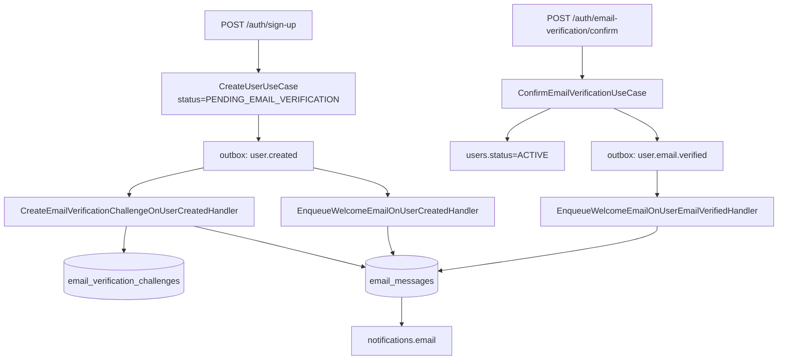

# Design - Email Verification

## Arquitetura

Esta feature fica centrada em `auth`, com alterações coordenadas em `users`, `notifications`, `shared/guards` e `shared/outbox`.



## Camadas e Módulos

### Auth

Auth será o dono do fluxo de verificação:

```text
api/src/modules/auth/
├── application/
│   ├── errors/
│   └── use-cases/
│       ├── confirm-email-verification/
│       ├── create-email-verification-challenge/
│       └── resend-email-verification/
├── domain/
│   ├── entities/
│   │   └── email-verification-challenge.entity.ts
│   ├── repositories/
│   │   └── email-verification-challenge.repository.interface.ts
│   └── value-objects/
│       └── email-verification-token.value-object.ts
├── infrastructure/
│   ├── mappers/
│   └── persistence/
├── presentation/
│   ├── dto/
│   └── http/
└── auth.module.ts
```

O módulo `auth` já possui controllers e use cases de autenticação. A feature deve seguir a estrutura existente sem criar um módulo top-level novo.

### Users

Alterações necessárias:

- adicionar `PENDING_EMAIL_VERIFICATION` em `UserStatus`;
- adicionar método de domínio para ativar usuário pendente, por exemplo `markEmailVerified()`;
- criar `UserEmailVerifiedEvent`;
- criar hydrator do evento e registrar em `UsersEventsModule`/`OutboxRehydratorsModule`;
- não alterar OAuth Google nesta feature.

### Notifications

Alterações necessárias:

- adicionar `EmailMessageType.EMAIL_VERIFICATION`;
- adicionar `EmailTemplateKey.EMAIL_VERIFICATION`;
- adicionar use case para criar intenção de e-mail de verificação;
- criar handler para `user.created` que cria challenge e e-mail quando o status for pendente;
- alterar handler de welcome em `user.created` para ignorar `PENDING_EMAIL_VERIFICATION`;
- criar handler para `user.email.verified` que chama o fluxo de welcome existente;
- documentar o novo template.

## Status e Autorização

### Status

Novo valor:

```text
PENDING_EMAIL_VERIFICATION
```

Banco:

```sql
ALTER TABLE "users" DROP CONSTRAINT "CHK_users_status";
ALTER TABLE "users"
  ADD CONSTRAINT "CHK_users_status"
  CHECK ("status" IN ('PENDING_PROFILE', 'PENDING_EMAIL_VERIFICATION', 'ACTIVE', 'BLOCKED'));
```

### Guard global

Criar um guard global depois de `JwtAuthGuard`, por exemplo:

```text
EmailVerificationStatusGuard
```

Comportamento:

- se rota for pública, permite;
- se não houver `request.user`, permite e deixa o guard de auth decidir;
- se `user.status !== PENDING_EMAIL_VERIFICATION`, permite;
- se a rota tiver metadata de liberação, permite;
- caso contrário, lança erro `EmailVerificationRequiredError`.

Decorator:

```text
@AllowPendingEmailVerification()
```

Metadata:

```text
ALLOW_PENDING_EMAIL_VERIFICATION_KEY
```

Rotas a marcar:

- `AuthController`, porque endpoints de autenticação e sessão são essenciais para usuários pendentes;
- `GET /users/me`;

`POST /auth/email-verification/confirm` permanece `@IsPublic()`.

## Endpoints

### POST /auth/email-verification/confirm

Auth: público.

Body:

```json
{
  "token": "token-completo-da-url"
}
```

Response `200`:

```json
{
  "object": "email_verification.confirmation",
  "status": "VERIFIED"
}
```

Regras:

- DTO valida `token` como string não vazia e com tamanho máximo documentado;
- controller não lê usuário da sessão;
- use case valida hash, expiração e consumo;
- confirmação bem-sucedida grava evento `user.email.verified`.

### POST /auth/email-verification/resend

Auth: `JwtAuthGuard` + `@AllowPendingEmailVerification()`.

Body: vazio.

Response `202`:

```json
{
  "object": "email_verification.resend",
  "status": "QUEUED"
}
```

Se usuário já estiver `ACTIVE`, resposta `200` idempotente:

```json
{
  "object": "email_verification.resend",
  "status": "ALREADY_VERIFIED"
}
```

Regras:

- usa `@CurrentUser()`;
- não aceita `email` nem `userId` no body;
- aplica cooldown/limite em transação;
- cria challenge novo e nova intenção de e-mail quando permitido.

## Data Model

### Tabela `email_verification_challenges`

```text
id uuid primary key
user_id uuid not null
email varchar(255) not null
purpose varchar(50) not null
token_hash varchar(64) not null
expires_at timestamptz not null
consumed_at timestamptz null
created_at timestamptz not null default now()
```

Constraints:

```text
PK_email_verification_challenges
FK_email_verification_challenges_user -> users.id ON DELETE CASCADE
CHK_email_verification_challenges_purpose
  purpose IN ('EMAIL_VERIFICATION')
CHK_email_verification_challenges_token_hash_length
  length(token_hash) = 64
CHK_email_verification_challenges_expiration
  expires_at > created_at
CHK_email_verification_challenges_consumed_after_created
  consumed_at IS NULL OR consumed_at >= created_at
```

Índices:

```text
idx_email_verification_challenges_token
  (purpose, token_hash)

idx_email_verification_challenges_email_purpose_created_at
  (email, purpose, created_at DESC)

idx_email_verification_challenges_user_purpose_created_at
  (user_id, purpose, created_at DESC)

idx_email_verification_challenges_unconsumed_expiration
  (purpose, expires_at)
  WHERE consumed_at IS NULL
```

Racional:

- `(purpose, token_hash)` sustenta confirmação por token;
- `(email, purpose, created_at DESC)` sustenta cooldown e limite 24h;
- `(user_id, purpose, created_at DESC)` sustenta consultas operacionais do usuário autenticado;
- índice parcial de não consumidos ajuda limpeza futura e diagnósticos.
- `email` é validado e normalizado pelo value object compartilhado `Email`, usando as mesmas regras do e-mail principal do usuário.

### Token

Geração:

- `crypto.randomBytes(32)`;
- token serializado em base64url;
- `token_hash = sha256(token).hex`.

Persistência:

- nunca salvar token em claro;
- nunca logar token;
- não incluir token em metadata de `email_messages`, logs ou erros.

TTL:

```text
15 minutos
```

### Configuração

Adicionar config de verification:

```text
EMAIL_VERIFICATION_TOKEN_TTL_MINUTES=15
EMAIL_VERIFICATION_RESEND_COOLDOWN_MINUTES=60
EMAIL_VERIFICATION_DAILY_LIMIT=5
NOTIFICATIONS_EMAIL_VERIFICATION_PATH=/verification-email
NOTIFICATIONS_EMAIL_VERIFICATION_PROVIDER_TEMPLATE_ID=<id-do-template>
```

`NOTIFICATIONS_EMAIL_VERIFICATION_PROVIDER_TEMPLATE_ID` precisa ser definido antes da implementação enviar e-mail real. Em ambiente local/teste pode usar provider noop.

## Fluxos

### Sign-up por credenciais

1. `SignUpUseCase` valida duplicidade como hoje.
2. Cria usuário com `status=PENDING_EMAIL_VERIFICATION`.
3. `User.create()` registra `user.created`.
4. `CreateUserUseCase` salva usuário e outbox na mesma transação.
5. `SignUpUseCase` gera tokens e cookies.
6. Frontend chama `GET /users/me` e lê `PENDING_EMAIL_VERIFICATION`.
7. Handler de `user.created` cria challenge e enfileira e-mail de verificação.

### Google OAuth

O fluxo Google OAuth não será alterado nesta feature. Qualquer decisão sobre `ACTIVE` ou `PENDING_PROFILE` em OAuth deve ficar para spec futura.

### Confirmação

1. Frontend recebe rota `/verification-email?token=<token>`.
2. Frontend envia `POST /auth/email-verification/confirm`.
3. Use case calcula hash.
4. Busca challenge por `purpose + token_hash`.
5. Valida expiração/consumo.
6. Em transação, bloqueia usuário e challenge.
7. Atualiza usuário para `ACTIVE`, consome challenge e grava `user.email.verified`.
8. Handler de notification cria welcome email idempotente.

### Resend

1. Usuário autenticado chama `POST /auth/email-verification/resend`.
2. Guard permite porque rota tem decorator.
3. Use case usa `CurrentUser`.
4. Se usuário `ACTIVE`, retorna `ALREADY_VERIFIED`.
5. Se usuário pendente, verifica cooldown e limite.
6. Cria novo challenge e nova intenção de e-mail.

## Eventos

### Alteração em `user.created`

Contrato atual já inclui `status` e `email`, suficiente para ramificar.

Handlers:

- verification handler só age quando `status=PENDING_EMAIL_VERIFICATION`;
- welcome handler ignora quando `status=PENDING_EMAIL_VERIFICATION`;
- demais handlers de onboarding técnico continuam como estão.

### Novo `user.email.verified`

Produtor: `users`, chamado pelo use case de confirmação em auth depois de alterar o aggregate de usuário.

Payload:

```json
{
  "userId": "uuid",
  "email": "user@example.com"
}
```

Metadados:

```text
eventName=user.email.verified
eventVersion=1
aggregateType=User
aggregateId=<userId>
deduplicationKey=user.email.verified:<userId>
```

Consumidor inicial:

- `notifications`: enfileirar welcome email idempotente.

## Notifications

### Verification Email

Novo template:

```text
template_key=email-verification
type=EMAIL_VERIFICATION
trigger=user.created + resend
```

Params:

```json
{
  "first_name": "Daniel",
  "verification_url": "https://app.danfy.com/verification-email?token=<token>",
  "expires_in_minutes": 15,
  "support_url": "https://..."
}
```

Idempotência:

- verification e-mail não deve ser idempotente apenas por usuário, porque resend precisa criar novas mensagens;
- usar chave por challenge:

```text
email:verification:challenge:<challengeId>
```

Welcome:

- manter chave atual `email:welcome:user:<userId>`;
- isso garante que welcome não duplica se `user.email.verified` for reprocessado.

## Erros HTTP

Adicionar application errors e mapear no `AppExceptionFilter`:

| Código | HTTP | Uso |
| --- | ---: | --- |
| `EMAIL_VERIFICATION_REQUIRED` | 403 | usuário pendente tentou acessar rota não liberada |
| `EMAIL_VERIFICATION_TOKEN_INVALID` | 400 | token ausente, malformado, inexistente ou challenge consumido sem idempotência possível |
| `EMAIL_VERIFICATION_TOKEN_EXPIRED` | 410 | challenge existe, mas expirou |
| `EMAIL_VERIFICATION_COOLDOWN_ACTIVE` | 429 | resend antes de 60 minutos |
| `EMAIL_VERIFICATION_DAILY_LIMIT_EXCEEDED` | 429 | mais de 5 envios em 24 horas |
| `EMAIL_VERIFICATION_USER_BLOCKED` | 409 | tentativa de confirmar usuário bloqueado |

Não expor:

- token;
- token hash;
- raw SQL;
- stack trace;
- payload bruto do provider de e-mail.

## Segurança

Controles:

- token aleatório de alta entropia;
- hash determinístico do token no banco;
- confirmação por `POST`;
- resend autenticado;
- resend deriva usuário do JWT;
- cooldown e limite por `email + purpose`;
- guard global deny-by-default para pendentes;
- tokens não aparecem em logs nem em `email_messages.metadata`;
- queries por token e contagem usam parâmetros TypeORM/query builder, sem interpolação.

Ataques mitigados:

- prefetch/crawler confirmando link via GET;
- usuário pendente acessando recursos de produto;
- spam por resend;
- token em claro vazado pelo banco;
- enumeração de e-mail no resend;
- duplicidade por retries de outbox.

## Concorrência e Consistência

Confirmação:

- usar transação;
- bloquear challenge e usuário com `pessimistic_write`;
- revalidar `consumed_at`, `expires_at` e status dentro da transação;
- gravar `user.email.verified` na outbox com o mesmo `EntityManager`.

Resend:

- usar transação;
- usar lock no usuário autenticado ou advisory lock transacional por `email + purpose`;
- contar challenges dos últimos 24h dentro da transação;
- buscar último challenge para cooldown dentro da transação.

Handler de `user.created`:

- precisa ser idempotente sob retry;
- se cooldown impedir duplicata imediata do mesmo evento, tratar como sucesso operacional sem relançar erro para outbox quando a duplicata for causada por retry.

## Impacto No Banco e Migrations

Criar migration para:

1. atualizar `CHK_users_status`;
2. criar `email_verification_challenges`;
3. criar constraints e índices;
4. não criar nova função `set_updated_at()`, pois a tabela não usa `updated_at` nesta spec.

Atualizar `docs/database/schema.md` na mesma tarefa.

## Testes

### Domain

- `EmailVerificationChallenge.create()` valida purpose, hash, expiração e consumo.
- `EmailVerificationChallenge.consume()` preenche `consumed_at` e é idempotente quando apropriado.
- `User.markEmailVerified()` só altera de `PENDING_EMAIL_VERIFICATION` para `ACTIVE`.

### Application

- sign-up credentials cria pendente e gera tokens.
- Google OAuth permanece sem alteração funcional.
- confirm token válido ativa usuário e grava evento.
- confirm token expirado falha.
- confirm token inválido falha.
- confirm usuário bloqueado falha.
- resend para pendente cria novo challenge.
- resend antes de 60 minutos falha.
- resend acima de 5 em 24h falha.
- resend para ativo retorna idempotente.

### Guards

- usuário pendente bloqueia rota protegida sem decorator.
- usuário pendente acessa rota com decorator.
- usuário ativo acessa rota protegida normalmente.
- rota pública continua pública.

### Notifications

- `user.created` pendente cria verification e não welcome.
- `user.created` ativo cria welcome e não verification.
- `user.email.verified` cria welcome.
- idempotência de welcome por usuário.
- verification email usa idempotency key por challenge.

### Infrastructure

- repository salva e reconstitui challenge.
- queries de cooldown/limite usam `email + purpose + created_at`.
- migration cria constraints/índices esperados.

### E2E

- sign-up retorna perfil pendente e cookies.
- pendente consegue `GET /users/me`.
- pendente não consegue criar recurso financeiro.
- pendente consegue resend.
- confirmação pública via POST ativa usuário.
- após confirmação, rota protegida deixa de retornar `EMAIL_VERIFICATION_REQUIRED`.

## Documentação

Atualizar:

- `docs/auth/flows/sign-up.md`;
- `docs/auth/flows/sign-in.md`;
- `docs/auth/flows/google-login.md`;
- `docs/auth/reference/endpoints.md`;
- `docs/auth/reference/error-codes.md`;
- `docs/integrations/auth/sign-up.md`;
- `docs/integrations/auth/get-me.md`;
- novo `docs/integrations/auth/email-verification.md`;
- `docs/events/README.md`;
- novo `docs/events/user-email-verified.md`;
- `docs/events/events-map.canvas`;
- `docs/notifications/email-templates/README.md`;
- novo `docs/notifications/email-templates/email-verification.md`;
- `docs/database/schema.md`;
- `docs/integrations/errors.md`.
