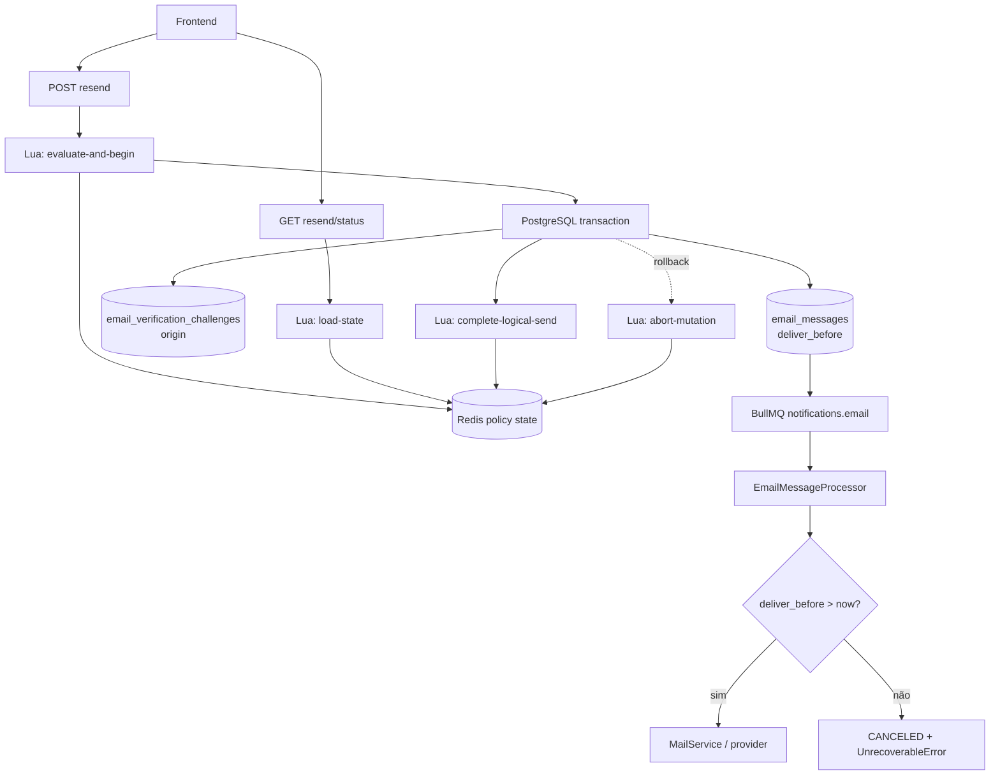

# Design - Email Verification

## Objetivo Técnico

Manter `email_verification_challenges` responsável pela autorização do token e
mover cooldown, janela móvel e coordenação concorrente do resend para uma
projeção operacional Redis. O fluxo deve persistir a origem do challenge,
impedir a entrega tardia de links sem uma janela mínima de uso e expor um
endpoint autenticado de status para o frontend.

## Requisitos Não Funcionais

- Decisões de cooldown e limite devem exigir uma única avaliação atômica no
  Redis, sem consultas repetidas ao PostgreSQL no caminho quente.
- Duas requisições concorrentes do mesmo usuário não podem confirmar dois
  resends lógicos.
- Ausência de chaves Redis é fail-open e inicializa estado vazio;
  indisponibilidade técnica do Redis é fail-closed antes de qualquer escrita
  manual no PostgreSQL.
- Um commit PostgreSQL nunca pode ser desfeito por falha posterior do Redis ou
  do BullMQ.
- Tokens, URLs de verificação, parâmetros de template e mutation tokens não
  podem aparecer em logs, erros ou respostas.
- O status deve ser barato para consultas pontuais do frontend, mas não é
  projetado para polling por segundo.
- Alterações das constantes de consumo exigem revisão de código e spec.

## Arquitetura


```mermaid
flowchart TD
  Client["Frontend"] --> Status["GET resend/status"]
  Client --> Resend["POST resend"]
  Resend --> Begin["Lua: evaluate-and-begin"]
  Status --> Load["Lua: load-state"]
  Begin --> Redis[("Redis policy state")]
  Load --> Redis
  Begin --> Tx["PostgreSQL transaction"]
  Tx --> Challenge[("email_verification_challenges\norigin")]
  Tx --> Intent[("email_messages\ndeliver_before")]
  Tx --> Complete["Lua: complete-logical-send"]
  Tx -. rollback .-> Abort["Lua: abort-mutation"]
  Complete --> Redis
  Abort --> Redis
  Intent --> Queue["BullMQ notifications.email"]
  Queue --> Worker["EmailMessageProcessor"]
  Worker --> Deadline{"deliver_before > now?"}
  Deadline -->|sim| Provider["MailService / provider"]
  Deadline -->|não| Cancel["CANCELED + UnrecoverableError"]
```

O envio automático percorre a mesma transação de challenge/intenção, persiste
`origin=AUTOMATIC` e chama `complete-logical-send` com cooldown de 60 segundos,
sem inserir membro no contador manual.

## Camadas E Módulos

### Auth

Auth continua dono da política de verificação:

```text
api/src/modules/auth/
├── application/
│   ├── errors/
│   ├── ports/
│   │   └── email-verification-resend-state-store.interface.ts
│   └── use-cases/
│       ├── confirm-email-verification/
│       ├── create-email-verification-challenge/
│       ├── get-email-verification-resend-status/
│       └── resend-email-verification/
├── domain/
│   ├── constants/email-verification.constants.ts
│   ├── entities/email-verification-challenge.entity.ts
│   ├── policies/email-verification-resend.policy.ts
│   ├── repositories/email-verification-challenge.repository.interface.ts
│   └── value-objects/email-verification-token.value-object.ts
├── infrastructure/
│   ├── cache/
│   │   ├── redis-email-verification-resend-state-store.ts
│   │   └── scripts/
│   ├── mappers/
│   └── persistence/
└── presentation/
    ├── dto/
    └── http/auth.controller.ts
```

- A policy codifica fórmula e precedência como regra pura e não conhece Redis,
  TypeORM, Nest ou HTTP; os scripts aplicam a mesma regra sobre o estado atômico.
- A store retorna uniões discriminadas para estado disponível, bloqueado e
  pendente; falhas técnicas são convertidas em erro de aplicação específico.
- Controllers permanecem finos; `Retry-After` de erros é serializado pelo filtro
  global e o header do endpoint de status é escrito pela apresentação a partir
  do resultado do use case.

### Notifications

Notifications continua dono da intenção e da entrega:

- `EmailMessage` ganha `deliverBefore: Date | null`.
- A intenção de verificação recebe o prazo já calculado; o worker não importa o
  repository de auth nem consulta challenges.
- `SendEmailMessageUseCase` torna a intenção `CANCELED` quando o prazo foi
  atingido e retorna um resultado terminal sanitizado.
- `EmailMessageProcessor` converte esse resultado em `UnrecoverableError`, pois
  BullMQ é uma preocupação de infraestrutura.
- O reconciliador não seleciona mensagens `CANCELED`.

Não será criada dependência circular `notifications -> auth`. Prioridades de
jobs são uma feature separada.

## Constantes Centrais

As regras ficam em `email-verification.constants.ts` como valores versionados:

```text
EMAIL_VERIFICATION_MANUAL_RESEND_LIMIT = 5
EMAIL_VERIFICATION_MANUAL_RESEND_WINDOW_SECONDS = 86_400
EMAIL_VERIFICATION_INITIAL_COOLDOWN_SECONDS = 60
EMAIL_VERIFICATION_MAX_COOLDOWN_SECONDS = 600
EMAIL_VERIFICATION_MINIMUM_USABLE_TOKEN_SECONDS = 300
EMAIL_VERIFICATION_MUTATION_TTL_SECONDS = 30
```

O cooldown confirmado depois de um envio é:

```text
automatic: 60
manual: min(60 * 2 ^ manualResendsUsedAfterSend, 600)
```

| Envio lógico confirmado | Contagem manual após envio |             Próximo cooldown |
| ----------------------- | -------------------------: | ---------------------------: |
| automático inicial      |                          0 |                         60 s |
| manual 1                |                          1 |                        120 s |
| manual 2                |                          2 |                        240 s |
| manual 3                |                          3 |                        480 s |
| manual 4                |                          4 |                        600 s |
| manual 5                |                          5 | 600 s, além do limite diário |

`EMAIL_VERIFICATION_TOKEN_TTL_MINUTES` permanece configuração do tempo do token,
mas o bootstrap deve rejeitar valores que violem:

```text
tokenTtlSeconds >= 600 + 300
```

As variáveis `EMAIL_VERIFICATION_RESEND_COOLDOWN_MINUTES` e
`EMAIL_VERIFICATION_DAILY_LIMIT` deixam de existir.

## Contrato HTTP

### POST /auth/email-verification/confirm

- Público.
- Recebe `{ "token": "..." }`.
- Retorna `200 email_verification.confirmation` quando confirmado.
- Mantém os códigos atuais de token inválido, expirado e usuário bloqueado.

### POST /auth/email-verification/resend

- Autenticado por cookie/JWT e liberado para
  `PENDING_EMAIL_VERIFICATION`.
- Body vazio; `userId` e e-mail vêm da identidade autenticada.
- Retorna `202 email_verification.resend` com `QUEUED` depois do commit da
  intenção, ainda que o enqueue imediato falhe e dependa do reconciliador.
- Usuário `ACTIVE` retorna `200 ALREADY_VERIFIED` sem tocar Redis ou banco.
- Cooldown, limite diário e mutação concorrente retornam `429` com o mesmo
  `retryAfterSeconds` inteiro positivo no body e em `Retry-After`.
- Redis indisponível antes da transação retorna
  `503 EMAIL_VERIFICATION_STATE_UNAVAILABLE` e não cria intenção.
- Se o commit SQL ocorreu e a finalização Redis falhar, a API preserva o sucesso
  `202`; retornar erro induziria repetição de uma mutação já confirmada.

### GET /auth/email-verification/resend/status

- Autenticado por cookie/JWT e liberado para usuário pendente.
- Não recebe body, e-mail ou `userId` arbitrário.
- Retorna `200` para estados disponíveis, bloqueados ou já verificados.
- Retorna `503 EMAIL_VERIFICATION_STATE_UNAVAILABLE` quando o Redis não pode
  responder para um usuário pendente.
- Define `Cache-Control: no-store`.
- Define `Retry-After` somente na forma bloqueada.

O endpoint usa uma união de response DTOs; cada forma possui seu próprio
`object`, conforme o contrato da plataforma.

Disponível:

```json
{
  "object": "email_verification.resend_status.available",
  "status": "AVAILABLE",
  "available": true,
  "manualResendsUsed": 2,
  "manualResendsRemaining": 3,
  "manualResendLimit": 5,
  "windowSeconds": 86400,
  "lastLogicalSendAt": "2026-08-25T12:00:00.000Z"
}
```

Bloqueado:

```http
HTTP/1.1 200 OK
Retry-After: 91
Cache-Control: no-store
```

```json
{
  "object": "email_verification.resend_status.blocked",
  "status": "BLOCKED",
  "available": false,
  "blockedBy": "COOLDOWN",
  "retryAfterSeconds": 91,
  "manualResendsUsed": 2,
  "manualResendsRemaining": 3,
  "manualResendLimit": 5,
  "windowSeconds": 86400,
  "lastLogicalSendAt": "2026-08-25T12:00:00.000Z"
}
```

`blockedBy` aceita `COOLDOWN`, `DAILY_LIMIT` ou `OPERATION_PENDING`. Quando mais
de uma restrição estiver ativa, representa a que produzir o maior
`retryAfterSeconds`.

Já verificado:

```json
{
  "object": "email_verification.resend_status.already_verified",
  "status": "ALREADY_VERIFIED",
  "available": false
}
```

O frontend consulta o endpoint na entrada da tela, após um resend, ao recuperar
foco/conectividade e quando seu contador local chegar a zero. Polling contínuo
por segundo fica fora do contrato recomendado.

## Modelo PostgreSQL

### email_verification_challenges.origin

Nova coluna:

```text
origin varchar(30) not null
```

Valores:

```text
AUTOMATIC
MANUAL_RESEND
LEGACY_UNKNOWN
```

- `AUTOMATIC` identifica o challenge inicial criado por `user.created`.
- `MANUAL_RESEND` identifica uma solicitação autenticada do usuário.
- `LEGACY_UNKNOWN` existe somente para backfill; novas criações não podem usá-lo.
- `CHK_email_verification_challenges_origin` restringe os valores.
- Um índice partial unique em `(user_id, purpose)` para
  `origin = 'AUTOMATIC'` garante um único challenge automático inicial, inclusive
  sob retry de outbox.

Estratégia da migration:

1. adicionar `origin` nullable;
2. preencher registros existentes com `LEGACY_UNKNOWN`;
3. tornar a coluna `NOT NULL`;
4. criar a check constraint;
5. criar o índice partial unique para origem automática;
6. não manter default SQL, obrigando novas escritas a declarar a origem.

Os índices históricos por `email + purpose + created_at` podem permanecer para
diagnóstico. Eles deixam de ser a autoridade de cooldown/limite e sua remoção só
deve ocorrer após medição de uso em alteração técnica separada.

### email_messages.deliver_before

Nova coluna:

```text
deliver_before timestamptz null
```

- `null` significa que a intenção não possui prazo funcional de início de
  entrega.
- Para verificação, o valor é
  `challenge.expires_at - EMAIL_VERIFICATION_MINIMUM_USABLE_TOKEN_SECONDS`.
- `CHK_email_messages_deliver_before` garante
  `deliver_before IS NULL OR deliver_before > created_at`.
- Não será criado índice: o worker carrega a mensagem pelo id e o reconciliador
  já filtra pelo estado/idade. Um índice sem consulta correspondente só
  aumentaria custo de escrita.

A migration altera exatamente essas duas tabelas. Na mesma tarefa,
`docs/database/schema.md` deve documentar colunas, constraint e índice. O
documento de schema atual não deve antecipar migration ainda não aplicada.

## Modelo Redis

O escopo operacional é o `userId`, porque resend e status são autenticados e
pertencem à conta. Todas as chaves usam a hash tag `{userId}`:

```text
auth:email-verification:{userId}:manual-resends
auth:email-verification:{userId}:cooldown
auth:email-verification:{userId}:last-send
auth:email-verification:{userId}:pending
```

| Chave            | Tipo   | Conteúdo                                            | TTL                                 |
| ---------------- | ------ | --------------------------------------------------- | ----------------------------------- |
| `manual-resends` | ZSET   | `challengeId -> logicalSendAtMs`                    | até o resend mais novo sair de 24 h |
| `cooldown`       | STRING | `logicalSendAtMs`                                   | cooldown calculado do último envio  |
| `last-send`      | STRING | JSON sanitizado com instante, origem e challenge id | 24 h                                |
| `pending`        | STRING | mutation token opaco                                | 30 s                                |

Não existe marcador `initialized`: ausência parcial ou total é deliberadamente
interpretada como estado vazio. O script de leitura remove membros vencidos do
ZSET antes de contar.

## Contratos TypeScript

Usar `as const` e uniões discriminadas, sem `enum` e sem `any`:

```ts
type EmailVerificationResendRestriction =
  | "COOLDOWN"
  | "DAILY_LIMIT"
  | "OPERATION_PENDING";

type BeginResendMutationResult =
  | { kind: "ACQUIRED"; mutationToken: string; manualResendsUsed: number }
  | {
      kind: "BLOCKED";
      blockedBy: EmailVerificationResendRestriction;
      retryAfterSeconds: number;
      manualResendsUsed: number;
    };
```

O adapter Redis valida tamanho, posição e valores retornados pelos scripts antes
de convertê-los. Resposta inesperada é indisponibilidade técnica, nunca
autorização implícita.

## Scripts Lua

Os scripts completos são documentados em
[`docs/auth/email-verification/lua-scripts.md`](../../../../auth/email-verification/lua-scripts.md).
O conjunto planejado é:

1. `LOAD_EMAIL_VERIFICATION_RESEND_STATE_SCRIPT`: usado pelo GET de status;
   limpa a janela, lê contadores/PTTLs e retorna a restrição efetiva.
2. `BEGIN_EMAIL_VERIFICATION_RESEND_MUTATION_SCRIPT`: usado antes da transação do
   POST; avalia janela/cooldown/pending e adquire a barreira com `SET NX PX`.
3. `COMPLETE_EMAIL_VERIFICATION_LOGICAL_SEND_SCRIPT`: usado após commit manual ou
   automático; registra estado, calcula cooldown e libera somente a barreira do
   dono.
4. `ABORT_EMAIL_VERIFICATION_RESEND_MUTATION_SCRIPT`: usado no rollback/erro antes
   do commit; remove `pending` apenas quando o mutation token confere.

Todos permanecem curtos, determinísticos, sem I/O externo e recebem o horário da
aplicação para testes reproduzíveis. Constantes são passadas em `ARGV`; não são
duplicadas como números mágicos no Lua.

## Fluxos

### Envio Automático

1. `user.created` pendente chega ao handler.
2. A transação cria ou recupera idempotentemente o único challenge automático e
   sua intenção de e-mail.
3. O challenge persiste `origin=AUTOMATIC`.
4. A intenção persiste `deliver_before=expiresAt-300s`.
5. Depois do commit, `complete-logical-send` grava `last-send` e cooldown de 60s,
   sem inserir no ZSET manual.
6. O producer tenta enfileirar; falha é recuperada pelo reconciliador.

### Resend Manual

1. O use case bloqueia/valida o usuário autenticado.
2. `begin-mutation` limpa a janela, avalia restrições e adquire `pending`.
3. Se bloqueado, o use case lança o `RetryAfterApplicationError` específico.
4. Se adquirido, a transação PostgreSQL bloqueia o usuário e cria challenge
   `MANUAL_RESEND` mais intenção com `deliver_before`.
5. Depois do commit, `complete-logical-send` adiciona o challenge ao ZSET, calcula
   o cooldown com a nova contagem, atualiza `last-send` e libera a barreira.
6. O producer tenta enfileirar e a API retorna `202`.
7. Em rollback, `abort-mutation` libera a barreira do dono.

### Consulta De Status

1. Usuário ativo retorna `ALREADY_VERIFIED` sem Redis.
2. Usuário pendente executa `load-state`.
3. Chaves ausentes produzem `AVAILABLE`, contagem zero e último envio nulo.
4. Restrições retornam a maior espera efetiva.
5. Controller serializa a forma do DTO, `Cache-Control` e `Retry-After` opcional.

### Entrega No Worker

1. O processor carrega e bloqueia a intenção como hoje.
2. Antes do provider, o use case compara `deliverBefore` com `now`.
3. `null` ou prazo futuro seguem o envio normal.
4. Prazo atingido marca a intenção `CANCELED` com código interno sanitizado.
5. O processor lança `UnrecoverableError`; BullMQ move o job para failed sem
   consumir as tentativas restantes.
6. O reconciliador ignora a intenção terminal.

## Erros E Contrato De Retry

| Código                                    | HTTP | Retry-After | Uso                                     |
| ----------------------------------------- | ---: | ----------- | --------------------------------------- |
| `EMAIL_VERIFICATION_REQUIRED`             |  403 | não         | pendente acessou recurso bloqueado      |
| `EMAIL_VERIFICATION_TOKEN_INVALID`        |  400 | não         | token inválido                          |
| `EMAIL_VERIFICATION_TOKEN_EXPIRED`        |  410 | não         | token expirado                          |
| `EMAIL_VERIFICATION_COOLDOWN_ACTIVE`      |  429 | sim         | cooldown ainda ativo                    |
| `EMAIL_VERIFICATION_DAILY_LIMIT_EXCEEDED` |  429 | sim         | cinco resends manuais na janela         |
| `EMAIL_VERIFICATION_OPERATION_PENDING`    |  429 | sim         | outra mutação possui a barreira         |
| `EMAIL_VERIFICATION_STATE_UNAVAILABLE`    |  503 | não         | Redis indisponível ou resposta inválida |
| `EMAIL_VERIFICATION_USER_BLOCKED`         |  409 | não         | confirmação de usuário bloqueado        |

Os três erros `429` herdam de `RetryAfterApplicationError`. O filtro global
serializa `details.retryAfterSeconds` e o header. A expiração de
`deliver_before` é resultado interno do worker e não é mapeada para HTTP.

## Consistência E Falhas

| Falha                                | Resultado                                                                 |
| ------------------------------------ | ------------------------------------------------------------------------- |
| Redis indisponível antes do resend   | `503`, nenhuma escrita SQL                                                |
| Chaves Redis ausentes                | estado vazio, operação permitida                                          |
| Concorrente durante `pending`        | `429` com PTTL da barreira                                                |
| Rollback SQL                         | `abort-mutation`; TTL é fallback                                          |
| Commit SQL e falha no complete Redis | intenção preservada, `202`, barreira expira e estado pode reiniciar vazio |
| Commit SQL e falha no enqueue        | reconciliador reenfileira a intenção                                      |
| Retry de `user.created`              | unique parcial impede segundo automático                                  |
| Worker recebe intenção fora do prazo | intenção cancelada, provider não chamado, job unrecoverable               |

Essa feature aceita deliberadamente que perda de estado Redis reinicie a
política. A origem no PostgreSQL preserva auditoria, mas não existe hidratação no
caminho quente desta entrega.

## Segurança

- Escopo Redis e queries usam `userId` do JWT/evento, nunca body arbitrário.
- Mutation token não aparece em log ou resposta.
- Scripts compare-and-delete impedem operação antiga de remover barreira nova.
- `last-send` não contém e-mail, token ou URL.
- Status não expõe challenge id, e-mail, causa interna do Redis ou provider.
- `Cache-Control: no-store` evita cache intermediário de estado do usuário.

## Migration E Schema

Criar uma única migration incremental para:

1. adicionar e preencher `email_verification_challenges.origin`;
2. criar `CHK_email_verification_challenges_origin`;
3. criar unique partial do challenge automático;
4. adicionar `email_messages.deliver_before`;
5. criar `CHK_email_messages_deliver_before`;
6. atualizar ORM entities e mappers;
7. atualizar `docs/database/schema.md` na mesma tarefa.

Não modificar migrations aplicadas. Não há necessidade de função ou trigger
novo.

## Estratégia De Testes

### Domain E Policy

- origem aceita no create e legado somente no reconstitute;
- sequência exata `60, 120, 240, 480, 600, 600`;
- limites exatos em `59/60`, `119/120`, `599/600` segundos;
- janela móvel em `24h - 1ms`, `24h` e `24h + 1ms`;
- limite manual ignora automático;
- policy escolhe a maior espera quando existem múltiplas restrições.

### Application

- resend disponível persiste entidade de domínio com `MANUAL_RESEND`;
- bloqueios lançam erros específicos com retry inteiro;
- estado ausente permite e inicializa;
- Redis indisponível impede transação;
- usuário ativo não consulta Redis;
- falha SQL chama abort; commit seguido de falha Redis não desfaz sucesso;
- status retorna cada forma da união sem mutar contadores.

### Redis/Lua

- testes de unidade do adapter com respostas válidas e inválidas;
- integração com Redis real para atomicidade, PTTL, pruning e compare-and-delete;
- duas reservas concorrentes resultam em uma aquisição;
- complete manual é idempotente pelo `challengeId`;
- complete automático não entra no ZSET e não encurta cooldown maior existente;
- todas as chaves permanecem no mesmo hash slot.

### PostgreSQL

- migration sobe e reverte preservando dados;
- legado recebe `LEGACY_UNKNOWN`;
- constraint rejeita origem inválida;
- unique parcial rejeita dois automáticos e aceita múltiplos manuais;
- `deliver_before` aceita null/futuro e rejeita prazo anterior/igual à criação;
- mappers preservam `Instant`.

Não existe query de otimização nova que justifique `EXPLAIN ANALYZE` nesta etapa;
qualquer novo acesso por lote deve ser analisado com dados representativos antes
de adicionar índice.

### Notifications/BullMQ

- intenção de verification calcula `deliver_before` corretamente;
- `deliver_before = now` cancela sem chamar MailService;
- `deliver_before = now + 1ms` pode seguir;
- intenção sem prazo preserva o comportamento atual;
- estado SQL fica terminal antes de `UnrecoverableError`;
- tentativas restantes não são consumidas e o reconciliador não reenfileira.

### HTTP/E2E

- status exige autenticação e usa o usuário do JWT;
- três response DTOs possuem `object` próprio;
- status bloqueado retorna `200`, body e `Retry-After` iguais;
- status disponível/ativo não retorna `Retry-After`;
- resend bloqueado retorna `429` com body/header;
- Redis indisponível retorna `503` sem intenção persistida;
- fluxo completo cobre automático, cinco manuais, janela móvel e confirmação.

Testes não usam `setTimeout`; relógio é injetado ou timestamps são passados aos
casos de uso/scripts.

## Documentação Afetada

- `docs/specs/auth/email-verification/specs/{requirements,design,tasks,decisions}.md`;
- `docs/auth/email-verification/{index,redis-keys,lua-scripts}.md`;
- `docs/auth/reference/{endpoints,error-codes,throttling}.md`;
- `docs/integrations/auth/email-verification.md`;
- `docs/integrations/errors.md`;
- `docs/configuration.md`, `.env` e `.env.exemple`;
- `docs/notifications/README.md`;
- `docs/notifications/email-templates/email-verification.md`;
- `docs/notifications/email-templates/template-model.md`;
- `docs/database/schema.md` junto da migration;
- Swagger decorators e response DTOs do `AuthController`.

O catálogo de prioridade de e-mails não faz parte desta spec e deve ser tratado
em feature separada.
