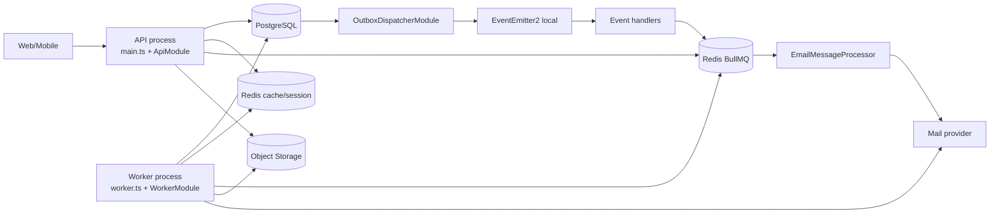
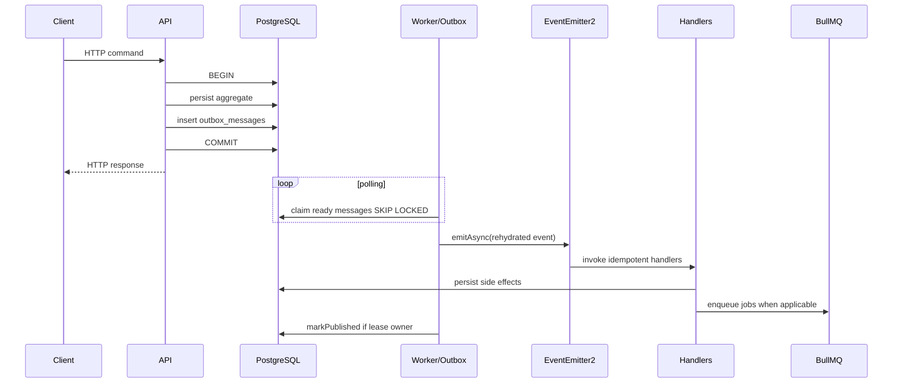

# Design - API and Worker Process Separation

## Resumo Arquitetural

O backend continuará sendo um monólito modular NestJS com um único repositório, um único package, um único build e um único schema PostgreSQL. A mudança cria duas composition roots:

- `ApiModule`, iniciado por `main.ts`, compõe capacidades HTTP e producers;
- `WorkerModule`, iniciado por `worker.ts`, compõe capacidades assíncronas e não abre servidor HTTP de negócio.

O limite entre processos ocorre em mecanismos persistentes:

- API para worker de eventos: tabela `outbox_messages`;
- API/handlers para worker de e-mail: Redis BullMQ, com `email_messages` como intenção persistida e fonte de reconciliação;
- EventEmitter2: somente dentro do worker, depois do claim da outbox.

Não existe comunicação EventEmitter2 entre API e worker.

## Arquitetura Alvo



## Fluxo De Eventos



## Composition Roots

### Organização Física Das Roots

```text
api/src/app/
├── api/
│   ├── api.controller.ts
│   └── api.module.ts
├── shared/
│   └── assert-process-role.ts
├── worker/
│   ├── composition/
│   │   ├── outbox-rehydrators.module.ts
│   │   └── worker-event-consumers.module.ts
│   ├── health/
│   │   ├── worker-health.module.ts
│   │   └── worker-health.service.ts
│   ├── operations/
│   │   ├── worker-heartbeat.service.ts
│   │   ├── worker-instance.ts
│   │   └── worker-operations.module.ts
│   └── worker.module.ts
└── process-composition.spec.ts
```

`app/api` e `app/worker` representam composition roots. Código de domínio e capacidades reutilizáveis continuam fora de `app`.

### API Root

Estrutura:

```text
api/src/
├── main.ts
└── app/
    └── api/
        ├── api.controller.ts
        └── api.module.ts
```

Responsabilidades do bootstrap HTTP:

- `NestFactory.create(ApiModule)`;
- cookies, CORS, Helmet, trust proxy e ValidationPipe;
- Swagger;
- global guards e `AppExceptionFilter`;
- `enableShutdownHooks()`;
- listen em `PORT`.

O `ApiModule` não importa:

- `ScheduleModule`;
- `AppEventsModule`;
- `OutboxDispatcherModule`;
- módulos de event handlers;
- módulos de processors BullMQ;
- `MailModule`, salvo se uma futura capacidade síncrona explicitamente exigir envio direto.

### Worker Root

Estrutura:

```text
api/src/
├── worker.ts
└── app/
    └── worker/
        └── worker.module.ts
```

Bootstrap:

```text
NestFactory.createApplicationContext(WorkerModule)
-> enableShutdownHooks
-> log workerInstanceId e capacidades ativas
-> manter context aberto até sinal de encerramento
```

O worker não configura:

- HTTP adapter/listen;
- controllers de negócio;
- Swagger;
- cookies/CORS/Helmet;
- global HTTP guards/filters;
- Passport/JWT strategies;
- throttling HTTP.

`WorkerModule` compõe:

- configuração worker;
- TypeORM;
- Redis de cache, enquanto necessário pelos repositories ativos;
- Jobs/BullMQ;
- EventEmitter2;
- ScheduleModule;
- Outbox dispatcher e hydrators;
- módulos de handlers de eventos;
- Notifications worker;
- health/heartbeat operacional sem rota HTTP pública.

## Organização De Módulos

### Banco Compartilhado

Extrair a configuração TypeORM atualmente inline no `ApiModule`:

```text
api/src/database/postgres/postgres.module.ts
```

`PostgresModule.forRoot()` deve encapsular `TypeOrmModule.forRootAsync` e `ENTITIES`. API e worker importam o mesmo módulo. `synchronize` continua `false`.

O módulo não executa migrations automaticamente. Migration continua como etapa explícita de deploy executada uma única vez.

### Outbox

Substituir o módulo único por capacidades separadas:

```text
api/src/shared/outbox/
├── outbox-persistence.module.ts
├── outbox-writer.module.ts
├── outbox-dispatcher.module.ts
├── persistence/
├── services/
└── interfaces/
```

#### OutboxPersistenceModule

Responsabilidades:

- registrar `OutboxMessageOrmEntity`;
- fornecer `OutboxMessageRepository`;
- não importar ScheduleModule ou EventEmitter2.

#### OutboxWriterModule

Responsabilidades:

- importar persistence;
- fornecer e exportar `OutboxWriteService`;
- ser importável pela API e por use cases sem iniciar processamento.

#### OutboxDispatcherModule

Responsabilidades:

- importar persistence, `ScheduleModule.forRoot()`, `AppEventsModule` e `OutboxRehydratorsModule`;
- fornecer `EventRegistry` e `OutboxProcessorService`;
- existir somente no grafo do worker.

`EventRegistry` pertence ao dispatcher, não ao writer. Hydrators só são necessários para leitura/processamento.

### Events

`AppEventsModule` deixa de ser importado pela API. Ele permanece global apenas dentro da composition root que o importa, ou deixa de ser global se imports explícitos tornarem o grafo mais claro.

Criar um agregador de consumidores:

```text
api/src/app/worker/composition/worker-event-consumers.module.ts
```

Esse módulo importa/exporta módulos de handlers, sem declarar regras de negócio próprias.

Módulos consumidores propostos:

```text
api/src/modules/accounts/accounts-event-handlers.module.ts
api/src/modules/categories/categories-event-handlers.module.ts
api/src/modules/assets/assets-event-handlers.module.ts
api/src/modules/auth/auth-event-handlers.module.ts
api/src/modules/notifications/notifications-event-handlers.module.ts
```

Cada módulo registra somente handlers `@OnEvent` e importa módulos de aplicação/persistência necessários. Handlers deixam de ser providers dos módulos HTTP.

Para evitar que o worker importe controllers, cada bounded context afetado deve separar pelo menos:

```text
<domain>-core.module.ts       repositories e use cases compartilhados
<domain>-http.module.ts       controllers e dependências HTTP
<domain>-event-handlers.module.ts
<domain>.module.ts            facade da composição HTTP, quando necessária
```

A implementação deve preferir módulos por capacidade em vez de duplicar provider bindings. Um repository token deve ter um único binding ativo em cada composition root.

### Notifications

Separar o módulo atual em:

```text
api/src/modules/notifications/
├── notifications-persistence.module.ts
├── notifications-producer.module.ts
├── notifications-event-handlers.module.ts
├── notifications-worker.module.ts
└── notifications.module.ts
```

#### NotificationsPersistenceModule

- registra `EmailMessageOrmEntity`;
- fornece `IEmailMessageRepository`;
- não conhece BullMQ nem MailService.

#### NotificationsProducerModule

- importa persistence e `JobsModule`;
- registra a queue `notifications.email`;
- fornece `EmailJobQueueProducer` via `BullmqEmailJobQueueProducer`;
- fornece use cases de criação de intenções usados por API/handlers;
- não registra `EmailMessageProcessor`;
- não importa `MailModule`.

#### NotificationsEventHandlersModule

- registra os handlers de `user.created` e `user.email.verified`;
- importa producer e acesso mínimo a users;
- existe somente no worker.

#### NotificationsWorkerModule

- importa persistence, queue registration e `MailModule`;
- fornece `SendEmailMessageUseCase`;
- registra `EmailMessageProcessor`;
- registra o reconciliador de enqueue;
- existe somente no worker.

`NotificationsModule` pode permanecer como facade temporária para a API, mas não pode voltar a misturar processor e producer.

### Auth

O handler `EnqueueEmailVerificationOnUserCreatedHandler` deve sair de `AuthModule` e entrar em `AuthEventHandlersModule`.

Extrair para um módulo compartilhável sem HTTP:

- repository de challenges;
- `CreateEmailVerificationChallengeUseCase`;
- dependencies exigidas pelo handler.

O worker não deve carregar `JwtModule`, Passport strategies, OAuth guards, session endpoints ou `AuthController` para executar esse handler.

`ResendEmailVerificationUseCase` permanece na API e depende do `NotificationsProducerModule`.

### Accounts, Categories E Assets

Mover os handlers atuais para módulos próprios:

- `ProvisionDefaultAccountOnUserHandler`;
- `ProvisionDefaultCategoriesOnUserHandler`;
- `DeleteReplacedAvatarOnUserHandler`;
- `DeleteRemovedAvatarOnUserHandler`.

Os módulos core devem exportar somente os use cases/repositories exigidos pelos handlers.

Assets worker continua dependendo de Object Storage porque a remoção física faz parte do handler atual. Essa dependência deve permanecer explícita.

### Users

O worker precisa:

- dos hydrators de eventos já expostos por `UsersEventsModule`;
- de leitura de user para notifications;
- de contracts/events do domínio.

Separar persistence/read providers de Users das capacidades HTTP de avatar evita carregar Sharp, upload e `UsersController` no worker quando não forem necessários. O worker só deve carregar Object Storage pelo fluxo de Assets que realmente o usa.

## Grafo De Dependências Alvo

```text
ApiModule
  -> ApiConfigModule
  -> PostgresModule
  -> RedisModule
  -> JobsModule
  -> OutboxWriterModule
  -> NotificationsProducerModule
  -> *HttpModule / modules sem consumers

WorkerModule
  -> WorkerConfigModule
  -> PostgresModule
  -> RedisModule
  -> JobsModule
  -> AppEventsModule
  -> OutboxDispatcherModule
  -> OutboxRehydratorsModule
  -> WorkerEventConsumersModule
  -> NotificationsWorkerModule
```

Dependências proibidas:

```text
ApiModule -> OutboxDispatcherModule
ApiModule -> NotificationsWorkerModule
ApiModule -> *EventHandlersModule
WorkerModule -> *HttpModule
WorkerModule -> AuthController/JWT/Passport/Swagger
domain/application -> BullMQ Queue concreto
shared/outbox -> modules de negócio
```

## Configuração Por Processo

Adicionar um tipo explícito:

```ts
export const ProcessRoles = {
  API: "api",
  WORKER: "worker",
} as const;

export type ProcessRole = (typeof ProcessRoles)[keyof typeof ProcessRoles];
```

O bootstrap recebe o role esperado e valida `PROCESS_ROLE`. Não usar enum TypeScript novo.

Configuração deve ser montada por dynamic module ou factories equivalentes:

```text
PlatformConfigModule.forApi()
PlatformConfigModule.forWorker()
```

### API Env

Obrigatório para API conforme capacidades atuais:

- PostgreSQL;
- Redis cache/sessão;
- Redis BullMQ producer;
- JWT;
- Google OAuth;
- app URL/frontend/CSRF;
- throttling;
- Object Storage/avatar;
- notification URLs/template IDs usados para criar intenções.

API não exige:

- `BREVO_API_KEY`;
- configuração de concurrency de consumer;
- configuração do scheduler de outbox.

### Worker Env

Obrigatório para worker combinado:

- PostgreSQL;
- Redis cache;
- Redis BullMQ;
- mail/Brevo quando `MAIL_ENABLED=true`;
- notification URLs/template IDs;
- Object Storage;
- outbox interval, batch, concurrency e lease;
- worker shutdown/health.

Worker não exige:

- JWT access/refresh secrets;
- Google OAuth credentials/callbacks;
- CSRF origins;
- throttle HTTP;
- API listen port.

### Variáveis Novas

```text
PROCESS_ROLE=api|worker
OUTBOX_POLL_INTERVAL_MS=1000
OUTBOX_BATCH_SIZE=25
OUTBOX_CONCURRENCY=5
OUTBOX_LEASE_MS=30000
OUTBOX_LEASE_RENEW_INTERVAL_MS=10000
WORKER_SHUTDOWN_TIMEOUT_MS=30000
EMAIL_ENQUEUE_RECONCILE_INTERVAL_MS=30000
EMAIL_ENQUEUE_RECONCILE_BATCH_SIZE=100
EMAIL_ENQUEUE_STALE_AFTER_MS=30000
WORKER_HEARTBEAT_INTERVAL_MS=10000
WORKER_HEARTBEAT_TTL_MS=30000
```

Validações:

- todos os tempos e tamanhos são inteiros positivos;
- renew interval deve ser menor que lease;
- batch size deve ser maior ou igual a concurrency;
- heartbeat interval deve ser menor que TTL;
- process role deve coincidir com o entrypoint.

`BULLMQ_WORKERS_ENABLED` deve ser removido do contrato e da documentação. A presença do processor passa a ser determinada pelo entrypoint/root module. Se compatibilidade temporária for necessária durante rollout, ela deve ser registrada em `decisions.md` e removida na mesma entrega.

## Outbox Processor

### Claim

Manter PostgreSQL como coordenador do claim:

```sql
WITH picked AS (
  SELECT id
  FROM outbox_messages
  WHERE ready_or_expired_condition
    AND attempts < max_attempts
  ORDER BY occurred_at, created_at
  LIMIT $limit
  FOR UPDATE SKIP LOCKED
)
UPDATE outbox_messages AS outbox
SET status = 'PROCESSING',
    locked_by = $lockedBy,
    locked_until = NOW() + ($leaseMs * INTERVAL '1 millisecond'),
    attempts = attempts + 1,
    updated_at = NOW()
FROM picked
WHERE outbox.id = picked.id
RETURNING explicit_columns;
```

Continuar usando parâmetros preparados e colunas explícitas.

### Ownership/Fencing

Alterar assinaturas:

```text
markPublished(messageId, lockedBy)
markFailed(message, lockedBy, error)
extendLease(messageId, lockedBy, leaseMs)
```

Todas usam condição equivalente:

```sql
WHERE id = $id
  AND status = 'PROCESSING'
  AND locked_by = $lockedBy
```

Resultado com zero linhas afetadas significa lease perdido. Não marcar a mensagem novamente e registrar warning operacional. O erro de lease perdido é interno ao worker e não entra no contrato HTTP.

### Batch E Concurrency

O processor deve:

- impedir ciclos de polling sobrepostos na mesma instância;
- reivindicar no máximo a capacidade disponível;
- processar mensagens com concurrency limitada;
- renovar lease das mensagens ativas em intervalo inferior ao lease;
- cancelar heartbeat/renovação no finally;
- não renovar mensagens que já terminaram;
- parar novos claims durante shutdown.

O EventEmitter2 pode executar listeners do mesmo evento concorrentemente. Se qualquer listener falhar, a tentativa de outbox falha e todos os listeners precisam tolerar repetição.

### Índices

O schema atual já possui:

- `idx_outbox_messages_ready` para `PENDING/FAILED`;
- `idx_outbox_messages_expired_locks` para `PROCESSING` expirado.

Não criar migration inicialmente. Antes de propor índice novo:

1. executar `EXPLAIN (ANALYZE, BUFFERS)` do claim com volume representativo;
2. confirmar plano, cardinalidade e custo;
3. atualizar esta spec e `docs/database/schema.md`;
4. criar migration incremental sem alterar migration aplicada.

## Reconciliador De Email Messages

### Problema

`email_messages` é confirmada no PostgreSQL antes de `Queue.add()`. Falha do Redis depois do commit pode deixar a intenção sem job, principalmente no resend HTTP, cujo cooldown pode impedir recuperação manual imediata.

### Estratégia

Adicionar no worker um serviço agendado que busca intenções reenfileiráveis antigas:

```text
status IN (PENDING, FAILED_RETRYABLE)
updatedAt/createdAt anterior a stale threshold
ORDER BY createdAt
LIMIT batchSize
```

Para cada intenção:

- chamar `EmailJobQueueProducer.enqueueEmailMessage(id)`;
- usar `jobId=email-message-<id>`;
- tratar job já existente como sucesso idempotente;
- não alterar status apenas por enfileirar;
- propagar/logar falha da queue e tentar no próximo ciclo;
- nunca carregar token ou template params no job.

O índice existente `(status, created_at)` deve ser reutilizado inicialmente. A implementação deve alinhar a query ao índice. Mudança para `updated_at` como chave principal exigirá análise de plano e possível migration documentada.

### Concorrência

Duas instâncias podem reconciliar a mesma intenção. Isso é aceitável porque:

- `email_messages.id` é único;
- `jobId` é determinístico;
- o processor respeita estado terminal;
- a intenção lógica não é duplicada.

O reconciliador não promete impedir a janela at-least-once entre provider e `SENT`.

## BullMQ

`JobsModule` continua centralizando conexão, prefix e defaults de job.

Mudanças obrigatórias:

- queue registration reutilizável por producer e worker;
- processor registrado apenas por `NotificationsWorkerModule`;
- concurrency realmente aplicada ao Worker BullMQ;
- shutdown deve pausar/fechar worker e aguardar jobs ativos conforme suporte da integração;
- queue events/listeners de observabilidade não devem ser registrados na API sem necessidade.

Producer continua dependendo da porta `EmailJobQueueProducer`, não de `Queue` concreto na aplicação.

## Error Handling

### API

Sem alteração no contrato de `AppExceptionFilter`. DomainError e ApplicationError continuam traduzidos somente na borda HTTP.

### Worker

Classificação:

- erro retentável de provider/storage/queue: relançar para outbox ou BullMQ;
- erro permanente conhecido: persistir estado terminal quando o domínio/application model suportar e concluir sem retry indevido;
- payload/hydrator inválido: falha operacional diagnosticável; comportamento `DEAD` imediato ou após tentativas existentes deve permanecer consistente até decisão específica;
- lease perdido: warning e abandono da atualização final;
- erro desconhecido: log interno sanitizado e retry conforme mecanismo chamador.

Não criar `HttpException` para falhas do worker. Se uma nova falha de aplicação precisar de classe, usar `ApplicationError` com code estável, mas não adicionar mapping HTTP se o erro nunca puder escapar por endpoint.

## Segurança E Multi-Tenancy

- Event payloads persistidos continuam validados pelos hydrators.
- Handlers continuam validando ownership por `userId`, mesmo que o payload venha da outbox.
- Jobs carregam apenas `emailMessageId`.
- Worker não recebe `userId` de request body.
- Logs mascaram PII e nunca incluem tokens de verificação.
- Worker de produção não recebe JWT/Google secrets.
- API de produção não recebe Brevo secret.
- Redis BullMQ não é exposto publicamente.
- Worker não publica porta no host.

## Health E Lifecycle

### API

Manter endpoints atuais e adicionar verificação de Redis BullMQ à readiness somente se a política definida considerar produção de jobs requisito para aceitar tráfego. Essa decisão deve ser explícita:

- recomendação: API continua ready com PostgreSQL e Redis de sessão; falha BullMQ degrada operações que produzem job, enquanto reconciliação recupera intenções persistidas;
- health deve reportar BullMQ como informação degradada quando possível, sem tornar toda leitura indisponível.

### Worker

Como o worker usa application context sem HTTP, implementar:

- `WorkerHeartbeatService` com instance id derivado de `HOSTNAME` ou UUID;
- heartbeat com TTL no Redis BullMQ ou storage operacional dedicado;
- comando one-shot `npm run health:worker` que verifica heartbeat da própria instância e conectividade com PostgreSQL, BullMQ Redis e cache Redis enquanto necessário;
- verificações das dependências em paralelo, cada uma com timeout de 2 segundos, para que conexões silenciosamente bloqueadas falhem antes do timeout externo do orquestrador;
- Docker healthcheck chamando esse comando;
- exit code `0` saudável, diferente de zero não saudável.

O health command não deve inicializar processors/schedulers.

### Shutdown

Bootstrap chama `enableShutdownHooks()`.

Ordem:

1. marcar worker como draining;
2. impedir novos claims/reconciliation cycles;
3. pausar/fechar BullMQ workers;
4. aguardar outbox handlers/jobs ativos até timeout;
5. remover/expirar heartbeat;
6. fechar application context e conexões.

## Build E Scripts

Adicionar scripts conceituais:

```text
start:dev             -> API watch
start:worker:dev      -> worker watch com entryFile worker
start:prod            -> node dist/main.js
start:worker:prod     -> node dist/worker.js
health:worker         -> node dist/worker-health.js
```

O build deve compilar todos os entrypoints. Não converter o projeto em Nest monorepo sem necessidade.

## Docker E Deploy

### Imagem

Usar uma única imagem versionada. O Dockerfile continua multi-stage e deve:

- conter `dist/main.js`, `dist/worker.js` e health command;
- executar como usuário não root;
- não conter `.env` ou secrets;
- manter Node.js 22;
- permitir override do command por serviço.

### Compose

```text
api:
  image/build comum
  command: node dist/main.js
  PROCESS_ROLE=api
  ports: 3000:3000

worker:
  image/build comum
  command: node dist/worker.js
  PROCESS_ROLE=worker
  sem ports
  healthcheck: npm run health:worker
```

Dependências:

| Processo | PostgreSQL | Redis cache                            | Redis BullMQ      | Object Storage | Brevo | JWT/OAuth |
| -------- | ---------- | -------------------------------------- | ----------------- | -------------- | ----- | --------- |
| API      | sim        | sim                                    | producer          | sim            | não   | sim       |
| Worker   | sim        | sim enquanto cached repos forem usados | producer/consumer | sim            | sim   | não       |

`api` e `worker` devem depender de Redis BullMQ saudável. No ambiente local, ambos usam o serviço `bullmq-redis` dedicado.

### Rollout

Ordem recomendada:

1. aplicar migrations pendentes uma única vez;
2. publicar imagem com os dois entrypoints;
3. iniciar worker novo;
4. validar heartbeat, outbox e BullMQ;
5. substituir API pelo entrypoint sem consumers;
6. verificar que apenas workers reivindicam outbox/jobs;
7. monitorar backlog e falhas.

Uma sobreposição curta entre processo antigo e worker novo é tolerada por SKIP LOCKED, leases e idempotência, mas deve ser limitada.

### Rollback

Como não há mudança de schema prevista:

1. interromper worker novo;
2. restaurar imagem/API anterior que ainda contém consumers;
3. verificar processamento de backlog;
4. preservar Redis BullMQ e PostgreSQL; não limpar filas/outbox.

Nunca usar `docker compose down -v` no rollback.

## Banco E Migrations

Nenhuma alteração de tabela, coluna, constraint, enum, trigger ou índice é prevista inicialmente.

O design reutiliza:

- `outbox_messages.locked_by` e `locked_until` para ownership/lease;
- índices atuais da outbox;
- `email_messages.status`, `created_at` e índice `idx_email_messages_status_created_at` para reconciliação;
- `set_updated_at()` e triggers existentes.

Se implementação ou `EXPLAIN` exigir mudança de schema:

- parar a implementação;
- atualizar requirements/design/tasks/decisions;
- revisar `docs/database/schema.md` e migrations relevantes;
- criar migration incremental;
- atualizar `docs/database/schema.md` na mesma task.

## Estratégia De Testes

### Unit

- configuração por role e validações cruzadas de interval/lease;
- bootstrap role mismatch;
- outbox processor limita concurrency e para em shutdown;
- transições passam `lockedBy`;
- lease perdido não marca published/failed;
- reconciliador filtra estados e usa producer/id determinístico;
- errors são propagados como retryable/permanent conforme contrato;
- processor de e-mail aplica concurrency configurada.

### Composition/DI

- `ApiModule` compila sem `OutboxProcessorService`;
- `ApiModule` compila sem `EmailMessageProcessor`;
- `ApiModule` não registra handlers `@OnEvent`;
- `WorkerModule` compila e contém dispatcher, hydrators, todos os handlers e processor;
- `WorkerModule` não contém controllers de negócio;
- nenhum binding de repository/port é duplicado ou ambíguo.

### PostgreSQL Integration

Usar PostgreSQL real/Testcontainers porque SQLite não suporta a semântica necessária:

- dois claims concorrentes não retornam a mesma mensagem;
- expired lock pode ser recuperado;
- stale worker não consegue `markPublished`/`markFailed`;
- lease renewal só funciona para owner atual;
- attempts/maxAttempts e `DEAD` permanecem corretos;
- query de reconciliação usa estados e ordenação esperados.

Executar `EXPLAIN (ANALYZE, BUFFERS)` para claim e reconciliação em dataset representativo antes de propor índices.

### BullMQ Integration

Teste opt-in com Redis dedicado:

- API producer adiciona job sem processor local;
- worker consome job;
- mesmo `jobId` não cria intenção lógica duplicada;
- retry ocorre para erro retentável;
- shutdown aguarda job ativo dentro do timeout;
- reconciliador recupera intenção persistida depois de falha simulada no primeiro enqueue.

Não usar Redis real nos testes unitários de cached repositories; manter `REDIS_CLIENT` mockado conforme regra do projeto.

### E2E/Smoke

- API health e endpoint simples funcionam com worker separado;
- sign-up grava `user.created`; worker provisiona Accounts/Categories e cria verificação/welcome conforme status;
- avatar update/remove produz evento e worker limpa asset antigo;
- email verification confirm produz welcome pelo worker;
- processo worker inicia sem rota HTTP pública;
- Compose sobe API e worker saudáveis.

Os testes de integração são executados por `npm run test:integration`. O comando compila os três entrypoints e usa Testcontainers com PostgreSQL 16, Redis 7 e Toxiproxy; Docker é um pré-requisito apenas para essa suíte.

## Documentação Impactada

Atualizar durante implementação:

```text
docs/events/README.md
docs/events/add-event.md
docs/events/user-created.md
docs/events/events-map.canvas
docs/platform/queue-infrastructure.md
docs/notifications/README.md
docs/auth/flows/sign-up.md
docs/integrations/auth/email-verification.md
docs/deploy.md
.env.exemple
api/src/shared/mail/README.md, se mencionar processo
```

Criar runbook:

```text
docs/platform/worker-operations.md
```

O runbook deve cobrir:

- start/stop/restart;
- health e logs;
- backlog outbox/BullMQ;
- mensagens `DEAD` e jobs failed;
- `email_messages` reenfileiráveis antigas;
- rollout e rollback;
- nunca apagar Redis/volumes como procedimento de recuperação.

## Riscos E Mitigações

| Risco                                             | Impacto                                          | Mitigação                                                                                             |
| ------------------------------------------------- | ------------------------------------------------ | ----------------------------------------------------------------------------------------------------- |
| API ainda registrar processor por import indireto | consumo duplicado ao escalar API                 | testes de composição e módulos por capacidade                                                         |
| Worker carregar controllers por module facade     | superfície HTTP acidental/futuro listen inseguro | WorkerModule importa apenas core/handlers e usa application context                                   |
| EventEmitter tratado como distribuído             | eventos não chegam ao worker                     | API só grava outbox; EventEmitter apenas no dispatcher worker                                         |
| Lease expirar durante lote                        | efeitos duplicados e update stale                | concurrency limitada, renewal e ownership nas transições                                              |
| Redis falhar após commit de email_messages        | intenção presa                                   | reconciliador persistência -> queue                                                                   |
| Provider aceitar e processo morrer antes de SENT  | possível e-mail duplicado                        | documentar at-least-once, metadata e observabilidade; avaliar idempotência de provider em spec futura |
| Worker exigir todos os secrets da API             | blast radius maior                               | schemas/env/secret sets por role                                                                      |
| Deploy criar lacuna sem consumer                  | backlog temporário                               | iniciar worker antes de remover consumers da API                                                      |
| Deploy criar sobreposição                         | repetição de handlers                            | SKIP LOCKED, leases e idempotência                                                                    |
| Config de concurrency continuar inefetiva         | throughput imprevisível                          | teste que inspeciona/aplica concurrency real do Worker BullMQ                                         |
