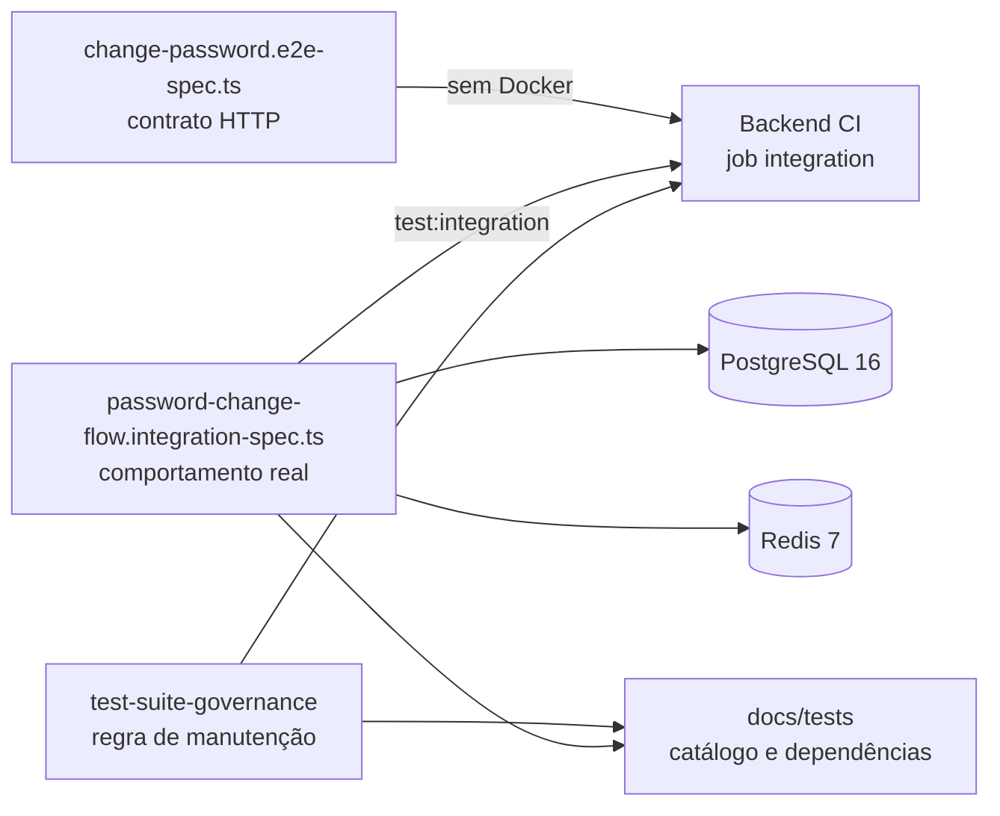

# Governança de testes E2E e integração — Design

## Resumo arquitetural

A entrega separa três responsabilidades:

1. o E2E existente continua validando a borda HTTP sem infraestrutura;
2. uma nova suíte de integração valida o fluxo real de credenciais com
   PostgreSQL e Redis;
3. documentação e skill governam dependências e manutenção futura das suítes.

Não será criado um módulo NestJS de produção. `docs/tests` é um módulo de
documentação, enquanto o teste monta somente os componentes necessários ao fluxo.



## Classificação do novo teste

O arquivo será `api/test/password-change-flow.integration-spec.ts`.

Embora o cenário represente uma jornada completa da credencial, ele não é um E2E
HTTP nesta arquitetura: não precisa provar novamente controller, pipes, filtro,
cookies e `Retry-After`. Esses contratos já pertencem a
`change-password.e2e-spec.ts`.

O novo teste precisa provar as integrações que os mocks atuais não alcançam:

```text
ChangeUserPasswordUseCase
        |
        +-- IUserRepository real
        |      +-- CachedUserRepository
        |      +-- UserRepository
        |      +-- TypeORM/PostgreSQL
        |
        +-- BcryptHashService real
        +-- PasswordChangeEventRepository real
        +-- RedisPasswordChangeStateStore real
        +-- RedisSessionRepository real
        +-- OutboxWriteService real
        +-- ChangePasswordPolicy real
```

## Isolamento em relação ao fluxo API/worker

O teste não será adicionado a `api-worker-flow.integration-spec.ts`.

O fluxo API/worker valida separação de processos, consumo da outbox, EventEmitter,
BullMQ, reconciliação e provider `noop`. A evidência que falta à troca de senha é
anterior ao worker: persistência da nova credencial, invalidação de cache,
autenticação, auditoria, outbox e sessões.

Manter um arquivo próprio:

- deixa o nome e a falha da suíte alinhados ao bounded context de autenticação;
- evita iniciar worker e BullMQ Redis sem necessidade;
- permite executar somente o fluxo de senha durante desenvolvimento;
- impede que uma suíte transversal acumule cenários de negócio não relacionados.

## Ambiente do teste

### Infraestrutura real

O `beforeAll` inicia e atribui individualmente:

- `PostgreSqlContainer('postgres:16-alpine')`;
- `RedisContainer('redis:7-alpine')` protegido por senha sintética.

O PostgreSQL usa portas efêmeras, `ENTITIES` e todas as migrations versionadas. O
Redis usa o host e a porta retornados pelo Testcontainers.

O `afterAll` fecha, nesta ordem lógica:

1. cliente Redis;
2. `DataSource`;
3. containers.

O startup atribui o PostgreSQL antes de iniciar o Redis. Assim, se a segunda
inicialização falhar, o teardown ainda possui o handle do primeiro container. O
cleanup deve tolerar inicialização parcial para não esconder a falha original.

### Componentes reais

O teste deve compor as implementações reais, preferencialmente por um
`TestingModule` mínimo ou por construção explícita quando isso evitar importar
módulos alheios ao cenário:

- `DataSource` com migrations;
- `UserRepository` e seu decorator `CachedUserRepository`;
- `RedisUserCacheInvalidator`;
- `PasswordChangeEventRepository`;
- `OutboxMessageRepository` e `OutboxWriteService`;
- `RedisPasswordChangeStateStore`;
- `PasswordChangeStateAssembler`, loader e synchronizer;
- `ChangePasswordPolicy`;
- `BcryptHashService`;
- `RedisSessionRepository`;
- `ChangeUserPasswordUseCase`;
- `FindUserByEmailUseCase` e `ValidateCredentialsUseCase`;
- `FindUserByIdUseCase`, `JwtStrategy` e `JwtRefreshStrategy` para validar versões
  antigas.

Não devem ser mockados repositories, hash, policy, state store ou sessão. Somente
configurações puras, como secrets JWT sintéticos, podem ser fornecidas como
valores de teste.

### Dados

Cada teste cria um usuário e provider `EMAIL` próprios. A senha antiga é hasheada
pelo `BcryptHashService`, e os registros iniciais devem respeitar as entidades e
migrations reais.

IDs, e-mails e JTI devem ser exclusivos. O Redis é limpo entre cenários ou as
asserções são restritas às chaves do usuário criado. O container descartável é a
fronteira final de limpeza.

## Cenários planejados

### Cenário 1 — Persistência e autenticação

```text
criar usuário com senha antiga
        |
validar credencial antiga = sucesso
        |
executar ChangeUserPasswordUseCase
        |
        +-- hash do provider muda
        +-- credentialVersion 1 -> 2
        +-- PASSWORD_CHANGED persistido
        +-- três fatos técnicos gravados na outbox
        +-- projeção Redis reconstruída
        |
validar credencial antiga = falha
validar credencial nova = sucesso
```

As asserções consultam comportamento e estado persistido. Não devem se limitar a
`toHaveBeenCalled`.

### Cenário 2 — Sessões e versão dos tokens

```text
criar sessão Redis + payloads com credentialVersion=1
        |
executar alteração de senha
        |
        +-- sessão removida
        +-- versão persistida = 2
        |
JwtStrategy rejeita payload antigo
JwtRefreshStrategy rejeita payload antigo
```

Os cenários não compartilham o usuário nem dependem da ordem de execução.

## Eventos esperados

O cenário de sucesso deve encontrar na outbox, para o usuário e o evento fonte:

- `auth.password-change.state-refresh-requested`;
- `auth.password-change.changed`;
- `auth.sessions.revoke-all-requested`.

O teste verifica nomes canônicos, aggregate, deduplicação e ausência de dados
sensíveis. Ele não inicia o worker nem aguarda a criação de `email_messages`.

## Documentação

### Estrutura

```text
docs/tests/
├── README.md                         # taxonomia, comandos e política
├── e2e/
│   ├── README.md                     # catálogo E2E e dependências comuns
│   ├── app.md
│   └── change-password.md
├── integration/
│   ├── README.md                     # catálogo e matriz de infraestrutura
│   ├── api-worker-flow.md
│   ├── bullmq-redis.md
│   ├── email-template-registry-postgres.md
│   ├── outbox-postgres.md
│   ├── password-change-flow.md
│   ├── password-change-postgres.md
│   ├── password-change-redis.md
│   ├── process-config.md
│   └── worker-health-recovery.md
└── reference/
    └── suite-documentation-template.md
```

### Conteúdo por suíte

Cada página segue o mesmo contrato:

1. caminho do teste;
2. responsabilidade e limites;
3. cenários cobertos;
4. componentes reais e mocks;
5. dependências e versões;
6. provisionamento, isolamento e cleanup;
7. comandos local e CI;
8. requisitos de Docker, rede e credenciais;
9. diagnóstico de falhas de ambiente;
10. gatilhos que obrigam atualizar a página.

Os `README.md` funcionam como índices e matrizes, não duplicam o conteúdo completo
das páginas.

### Integração com documentação existente

`docs/platform/continuous-integration.md` deve apontar para `docs/tests/` como
fonte do catálogo das suítes e dependências. O documento de CI continua sendo a
fonte do desenho dos jobs.

## Skill local

### Local e nome

A implementação criará a skill versionada:

```text
.agents/skills/test-suite-governance/
├── SKILL.md
├── agents/
│   └── openai.yaml
└── references/
    └── dependency-impact-checklist.md
```

Ela será inicializada pelo `init_skill.py` do `skill-creator`, e não por criação
manual do esqueleto.

### Trigger

A descrição deve ativá-la ao criar, alterar, renomear ou remover:

- `api/test/*.e2e-spec.ts`;
- `api/test/*.integration-spec.ts`;
- configurações Jest dessas suítes;
- dependências ou serviços necessários para executá-las;
- passos de E2E ou integração na pipeline.

### Fluxo obrigatório

```text
identificar suíte e classificação
        |
ler docs/tests + teste + Jest + package.json + workflow
        |
inventariar dependências antes/depois
        |
dependência nova?
   | não                         | sim
   v                             v
atualizar página da suíte     produzir estudo de impacto
   |                             |
   +-------------+---------------+
                 v
      pipeline precisa mudar?
          | não          | sim
          v              v
       validar       comunicar e obter decisão
                          |
                   atualizar spec/CI/docs
```

A checklist detalhada fica em `references/dependency-impact-checklist.md` para
manter o `SKILL.md` conciso.

### AGENTS.md

Não será adicionada uma segunda cópia extensa da política ao `AGENTS.md`. A skill
local é preferida porque possui trigger próprio e pode carregar a checklist por
divulgação progressiva. Se a descoberta automática da skill não funcionar no
ambiente do projeto, a implementação deve parar e registrar uma decisão antes de
adicionar uma instrução curta ao `AGENTS.md`.

## Impacto na pipeline

### Estado atual

O workflow `.github/workflows/backend-ci.yml` possui:

- job `tests`, sem Docker, que executa unitários e E2E;
- job `integration`, em `ubuntu-24.04`, que executa
  `npm run test:integration` com timeout de 20 minutos;
- Testcontainers já usado por PostgreSQL, Redis e Toxiproxy.

O Jest de integração usa `*.integration-spec.ts` e `--runInBand`. Portanto, o novo
arquivo será descoberto sem alterar YAML ou scripts.

O comando `npm run test:integration` permanece agregador: ele executa todos os
arquivos correspondentes a `*.integration-spec.ts` em sequência. O novo teste não
receberá script próprio no `package.json`, e o workflow não usará filtro por nome
ou caminho.

### Efeito previsto

| Aspecto                      | Efeito                                                       |
| ---------------------------- | ------------------------------------------------------------ |
| Nova dependência npm         | nenhum                                                       |
| Novo serviço na CI           | nenhum                                                       |
| Mudança no workflow          | nenhuma inicialmente                                         |
| Job afetado                  | `integration`                                                |
| Tempo                        | aumenta pelo startup de um PostgreSQL, um Redis e dois bcrypt |
| Pico de recursos             | limitado; arquivos executam em sequência                     |
| Rede externa da aplicação    | nenhuma                                                      |
| Download de imagens          | imagens já usadas pela suíte atual                           |
| Secrets                      | nenhum; somente valores sintéticos                           |
| E2E leve                     | permanece sem Docker                                         |

O baseline remoto observado antes da implementação é 1m39s para timeout de 20m.
Após a implementação e as correções de revisão, a execução local agregada final
aprovou 9 suítes e 36 testes em 68,47s totais, com 60,979s do Jest e pico medido de
669.328 KiB. Os valores não são tratados como SLA, mas confirmam ampla margem sem
mudança de pipeline.

### Condição para alterar a pipeline

Não há alteração planejada em `.github/workflows/backend-ci.yml`.

Se a execução completa revelar risco operacional, a implementação deve:

1. registrar tempo e causa;
2. atualizar `requirements.md`, `design.md`, `tasks.md` e `decisions.md` desta
   spec;
3. atualizar a spec `docs/specs/platform/backend-ci/specs/`;
4. comunicar ao responsável antes de editar o workflow;
5. preferir reduzir dependências ou setup antes de aumentar timeout ou criar
   paralelismo.

## Alternativas consideradas

### Adicionar o cenário ao `api-worker-flow.integration-spec.ts`

Reduziria o número de startups de containers, mas acoplaria a prova de credencial
ao worker, BullMQ, provider de e-mail e esperas assíncronas. Rejeitada por misturar
responsabilidades e dificultar execução focada.

### Transformar `change-password.e2e-spec.ts` em E2E real

Tornaria `npm run test:e2e` dependente de Docker e quebraria a separação explícita
da pipeline. Rejeitada.

### Compartilhar containers globalmente entre arquivos Jest

Poderia reduzir tempo, mas introduziria estado global, cleanup complexo e risco de
dependência de ordem. Rejeitada enquanto o tempo do job estiver confortável.

### Usar somente PostgreSQL

Não provaria projeção, barreira, invalidação de cache e remoção de sessões.
Rejeitada.

## Segurança e confiabilidade

- senhas, hashes, JWTs e secrets não entram em snapshots ou mensagens de erro;
- todos os valores de configuração são sintéticos;
- nenhum provider externo é habilitado;
- portas são efêmeras;
- containers e clientes são finalizados mesmo após falha;
- não há retries para esconder falhas determinísticas;
- o teste não depende de relógio fixo entre processos nem de `setTimeout`;
- uma falha de Docker é classificada separadamente de uma regressão funcional.

## Validação

Comandos planejados, executados a partir de `api/` quando aplicável:

```bash
# Atalho opcional para desenvolvimento e diagnóstico da nova suíte.
npm run test:integration -- --runTestsByPath test/password-change-flow.integration-spec.ts

# Validação canônica e obrigatória: executa todas as suítes de integração.
npm run test:integration
npm run test:e2e -- --runInBand
npm run lint:check
npm run typecheck
npm run build
```

O primeiro comando não substitui o segundo. A CI e a validação final usam sempre a
execução completa.

A skill será validada com:

```bash
python3 /home/daniel/.codex/skills/.system/skill-creator/scripts/quick_validate.py \
  .agents/skills/test-suite-governance
```

Os caminhos citados na documentação devem ser conferidos contra `rg --files`.

## Impactos

- Banco e migrations: nenhum.
- API e frontend: nenhum.
- Código de produção: nenhum.
- Testes: uma nova suíte de integração.
- CI: aumento mensurável de duração no job existente, sem mudança inicial de YAML.
- Documentação: novo módulo `docs/tests` e link na documentação da CI.
- Ferramentas de agente: nova skill local versionada.
